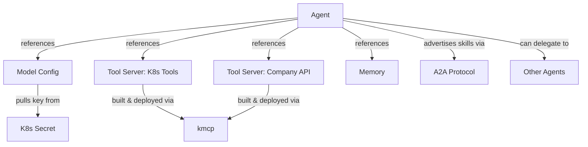
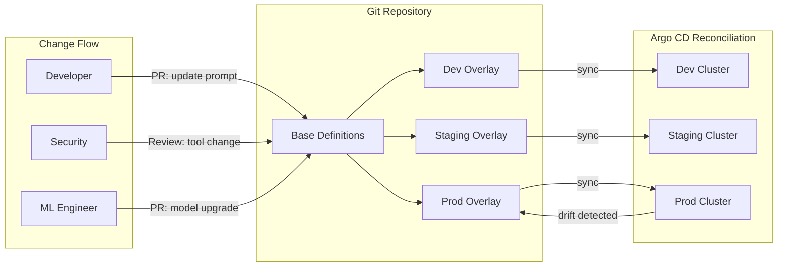
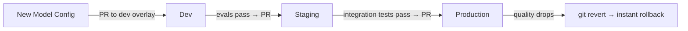

*Sebastian Maniak — Solo.io*

---

If your team has been running Kubernetes for any length of time, you've probably already adopted some form of GitOps — a Git repository as the source of truth, a reconciliation loop that makes your cluster match what's declared, pull requests as the change management workflow. It's become table stakes for production infrastructure.

So when AI agents enter the picture, the instinct is natural: treat them like any other workload, deploy them the same way. And plenty of teams are doing exactly that — containerizing their agents, writing Helm charts, pointing Argo CD at a repo, and calling it done.

That works, up to a point. But agents introduce a set of management challenges that go beyond what traditional GitOps was designed for. An agent isn't just a container with some config. It's a system prompt, a model selection, an effort setting, a set of tools, memory backends, and the non-deterministic reasoning of an LLM — all interacting in ways that make the standard "code + config" model feel incomplete.

The question isn't whether to use GitOps for agents. Of course you should. The question is whether your current GitOps setup gives you the right abstractions to manage what actually makes agents different. That's where kagent comes in — it gives Kubernetes a native understanding of what an agent is, so your existing GitOps workflows can manage the things that actually matter.

## What Makes Agents Different From Other Workloads

When a microservice misbehaves after a deployment, you can usually point at a code change or a config change and say "that's the one." The behavior is deterministic. Same input, same output. Fix the code, redeploy, move on.

Agents have a wider blast radius.

An agent's behavior emerges from the intersection of several things at once: its system prompt, its model, its effort setting, the tools it has access to, and the non-deterministic reasoning of the LLM itself. Change any one of those and you might get a meaningfully different agent. Swap the underlying model and the same agent with the same prompt starts making different decisions about which tools to call and in what order. Adjust the effort and a previously reliable agent starts producing inconsistent output. Grant access to one new tool and the agent starts reaching for it in situations you didn't design for.

If you're deploying agents as generic containers with environment variables and config maps, these changes are all happening at the same level of abstraction. A model swap looks the same as bumping a memory limit. A prompt edit is just another config change. There's no structure that tells your GitOps tooling — or your team reviewing the PR — that one of these changes is cosmetic and the other fundamentally alters how the agent behaves.

That's the gap. Not "do you have GitOps?" — you probably do. It's "does your GitOps pipeline understand the anatomy of an agent well enough to give you meaningful control?"

## What Agent-Aware GitOps Actually Looks Like

The GitOps principle doesn't change: desired state in Git, reconciliation loop making reality match. What changes is what counts as "desired state." When agent-specific concerns become first-class objects in your pipeline — not opaque blobs inside a container — you get three things you didn't have before:

**Prompts you can actually review.** Right now, a prompt probably lives somewhere inside your application code, tangled up with everything else. Pull it out into its own declarative resource and suddenly a prompt edit is a focused PR — one diff, one review, one approval. The behavioral change stands on its own instead of hiding inside a code commit.

**Model upgrades you can roll back in isolation.** When the model config is its own resource, swapping from one model to another is a single, isolated change. Promote it through dev → staging → production on its own timeline. If quality drops, revert that one resource. Nothing else moves.

**Tool access you can govern like a permission.** Each agent declares exactly which tools it can use — not "everything this server offers," but a specific, named list. Adding a tool is a one-line diff. Removing one is equally clear. The PR is the approval process for what an agent is allowed to do.

## How kagent Makes This Work

[kagent](https://kagent.dev) is a Kubernetes-native framework that models agents as custom resources — the same declarative, reconcilable building blocks that platform teams already use for everything else. This is the design choice that makes GitOps for agents practical rather than theoretical.

The architecture splits an agent's definition into independent, composable resources:

The **Agent** is the top-level resource. It defines the system prompt, references a model configuration, declares which tools are available (and critically, *which specific tools* from each tool server — not blanket access), sets resource limits, and advertises skills to other agents via the A2A protocol.

The **Model Configuration** is a separate resource that defines the LLM provider, model version, and parameters like temperature and token limits. Because it's independent, you can swap models without touching agent definitions. You can share one model config across twenty agents. You can run a canary by creating a new model config alongside the existing one and pointing one agent at it.

**Tool Servers** define the MCP servers that provide capabilities to agents. This is where kagent's skill model lives. Each tool server exposes a set of tools, and agents cherry-pick the specific ones they need. You don't give an agent access to "all Kubernetes tools" — you give it access to the five read-only tools it actually needs and leave the destructive ones off the list. That scoping decision is declared in the agent resource and reviewed in the PR.

**Skills** deserve a closer look. In kagent's model, an agent's capabilities come from tool servers — MCP servers that expose tools the agent can call. [kmcp](https://github.com/kagent-dev/kmcp) is the toolkit for building, testing, and deploying these as production services. kagent ships with built-in tool servers for common operational needs — Kubernetes, Helm, Argo, Istio, Prometheus, Grafana, Cilium — but the real power is in custom skills: your company's internal APIs, your domain-specific workflows, your proprietary data sources, all packaged, versioned, and deployed the same way.

When an agent declares skills in its A2A configuration, it advertises capabilities that other agents can discover. A supervisor agent doesn't need to know implementation details — it just needs to know the skill exists and how to invoke the agent that has it. Multi-agent orchestration becomes a graph of declared relationships, all visible in the same configuration files.

## The GitOps Workflow for Agents

Here's how it all comes together in practice. The flow follows the same base-and-overlay pattern that platform teams already use for microservices, extended to cover the full agent stack:

The base definitions contain the canonical agent configurations — agent resources, model configs, tool servers, and skills. Overlays customize per environment: dev might use a local model to keep costs down, staging might use a mid-tier cloud model for integration testing, and production runs the most capable model with proper scaling and multiple replicas.

What makes this powerful for agents specifically is how different types of changes flow through the system:

### Prompt Changes Become Code Reviews

When your system prompt lives in a declarative resource in Git, prompt engineering becomes a reviewable activity. Someone rewrites a paragraph of the system prompt — that's a PR with a clear diff. The team can read it, discuss it, push back on it, and approve it. After it's merged, you can trace any line of any system prompt back to the PR that introduced it, the discussion that shaped it, and the person who signed off on it.

This matters more than it sounds. Prompt changes are the most impactful behavioral changes you can make to an agent. A subtle rewording can completely alter how it uses tools or handles edge cases. Without version control, those changes are invisible. With GitOps, they're first-class, auditable events.

### Model Upgrades Become Staged Rollouts

New model drops. Instead of flipping a switch across your entire agent fleet, you update the model configuration in your dev overlay. Argo CD syncs it. You run evals. If they pass, you promote the change to staging and run integration tests against real traffic patterns. If staging holds, you promote to production and monitor quality metrics.

If quality drops at any stage, you revert the model config change — one commit, full rollback, the old model is back in minutes.

You can even run canaries. Create a new model configuration alongside the existing one, point a single agent at it, and compare quality side-by-side before migrating the rest of the fleet.

### Tool Access Changes Become Security Reviews

Adding a tool to an agent's allowed list is granting a permission. When an agent gains access to a destructive capability — deleting resources, writing to a database, calling an external API — that's a security-relevant change. GitOps makes it visible by default: the change shows up as a one-line diff in a pull request.

You can put CODEOWNERS rules on tool configuration so changes require security team review. You can write CI checks that enforce policy — no agent in a customer-facing namespace gets tools that modify infrastructure. The pull request becomes your approval process.

### Skill Development Gets a Real Lifecycle

Custom skills — the MCP servers that give agents domain-specific capabilities — live in the same repository and go through the same workflow. A developer builds a new skill with kmcp, tests it locally, commits the source alongside the tool server configuration that deploys it, and opens a PR. The skill goes through review, gets deployed to dev, gets tested, and promotes through environments just like everything else.

Because tool servers are referenced by name, you can roll out a new version of a skill independently of the agents that use it. Or you can pin specific agents to specific versions if stability matters more than getting the latest capabilities.

## The Reconciliation Loop: Why Self-Healing Matters for Agents

Any GitOps controller works with kagent — Flux, Argo CD, even a simple apply step in CI. But the reconciliation loop is where the real value lives, and it matters more for agents than for traditional workloads.

Here's the scenario. It's 2 AM. An incident is happening. Someone `kubectl edit`s an agent's system prompt to change its behavior during the incident. Totally reasonable in the moment. The incident resolves, everyone goes to sleep. Three weeks later, the agent is behaving oddly and nobody can figure out why. The team spends half a day investigating before someone thinks to diff the running config against Git and finds the untracked prompt change.

With GitOps and self-healing enabled, this doesn't happen. The reconciliation loop detects the drift within minutes and reverts the agent to match what's declared in Git. If you actually need to change the agent's behavior, you do it through a PR — which means the change is tracked, reviewed, and reversible.

## What Changes at Scale

The benefits compound as the number of agents grows. With a handful of agents, the overhead of agent-aware GitOps is marginal. At scale — dozens of agents across multiple teams and environments — it starts paying for itself in ways that are hard to get otherwise.

**Drift detection and self-healing** mean no agent runs a configuration that wasn't committed and reviewed. **Rollback on any dimension** — prompt, model, tools — is a git revert away. **Environment promotion** is a pull request between overlays. **The audit trail** is just Git history, filterable to any agent's files, with timestamps, authors, and the PR discussions attached.

**Multi-tenancy** maps naturally to Kubernetes namespaces. Different teams own different agents, each synced from their own path in the repository. Model configs and tool servers can be shared across namespaces using cross-namespace references, so the platform team provides shared infrastructure while application teams own their agent definitions.

And when you pair kagent with [agentgateway](https://agentgateway.dev), the traffic layer — routing, rate limiting, model failover, cost budgets — lives in the same repository and syncs through the same pipeline. One repo describing the full agent stack: what agents do, what skills they have, how their traffic flows, and how it all gets secured.

## Where This Is Heading

The teams that are already deploying agents with GitOps are in a good position. The next step is making sure the abstractions match the workload. Treating an agent as a generic container with env vars works until you need to roll back a model change independently of a prompt change, or review a tool access grant as a security decision, or promote a new skill through environments without touching the agents that use it.

kagent gives Kubernetes a native understanding of these concerns. It fits into the GitOps infrastructure you've already built — same Argo CD, same Kustomize overlays, same PR workflows — and adds the agent-specific structure that turns generic deployment into meaningful lifecycle management.

The agents you're running today are probably manageable. The question is whether your setup scales to the agents you'll be running a year from now, when there are more of them, more teams building them, and more at stake when something goes wrong. That's the problem worth solving now.

---

*kagent is a CNCF Sandbox project. [kagent.dev](https://kagent.dev) · [github.com/kagent-dev/kagent](https://github.com/kagent-dev/kagent)*

*agentgateway is an LF / AAIF project. [agentgateway.dev](https://agentgateway.dev)*
