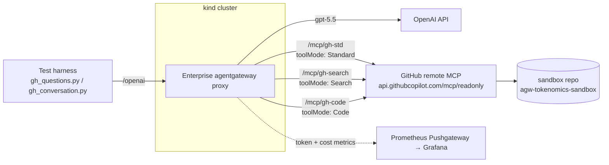

Every time an LLM talks to an MCP server, it has to be *told what tools exist*. That tool catalog — the JSON schema of every tool, its parameters, and descriptions — is injected into the prompt on **every single turn**. For a small server that's a rounding error. For GitHub's MCP server, with 28 read-only tools and verbose schemas, it's **4,781 tokens of pure overhead per call** — before the model has done any actual work.

That overhead is the hidden tax of MCP, and it's the subject of this post. Using [Enterprise agentgateway](https://agentgateway.dev) in front of GitHub's official remote MCP server, I measured three different ways to expose those tools to an LLM and tracked the real USD cost of each. The result is clear and a little counter-intuitive: **for a large catalog like GitHub's, Search mode cuts per-call cost by ~60% and wins across conversations too.**

All the code, manifests, harness scripts, and raw results are in the demo repo:

👉 **[sebbycorp/agentgateway-demos / 104-ent-github-tokenomics](https://github.com/sebbycorp/agentgateway-demos/tree/main/104-ent-github-tokenomics)**

This article walks through how it was deployed, what the numbers were, *why* they came out this way, and how you can flip your own gateway into Search mode.

## The setup at a glance

| Component | Value |
|---|---|
| **Backend** | GitHub's external remote MCP server — `api.githubcopilot.com/mcp/readonly` |
| **Tools exposed** | 28 read-only tools (`get_*`, `list_*`, `search_*`) |
| **Front door** | Enterprise agentgateway (injects the GitHub PAT as a `Bearer` token upstream) |
| **Model** | `gpt-5.5` via the agentgateway `/openai` route |
| **Scope** | One dedicated public sandbox repo: [`sebbycorp/agw-tokenomics-sandbox`](https://github.com/sebbycorp/agw-tokenomics-sandbox) |
| **Pricing (est.)** | input `$0.005`/1K · cached input `$0.0025`/1K · output `$0.015`/1K |
| **Method** | 5 questions × 3 modes (single-call) + a 5-turn conversation × 3 modes, run **three times** |

A key safety property: every question is pinned to a single repo, the gateway only talks to the **`/mcp/readonly`** endpoint (no mutation tools), and the GitHub PAT is fine-grained and scoped to that one repo. The test physically *cannot* touch anything else.

## Architecture

agentgateway sits between the LLM and GitHub. There is **no MCP pod to build or run** — GitHub's MCP server is external and remote. The gateway targets it over TLS and injects your PAT. The same gateway also fronts the OpenAI-compatible model route, so one proxy sees both sides of the conversation and can meter tokens.



## The three tool modes

The whole experiment hinges on **how** the gateway presents GitHub's 28 tools to the model. Enterprise agentgateway's MCP backend supports three `toolMode` values, each a different point on the "context vs. round-trips" trade-off.

### Standard — the catalog goes in every turn
- **What the model sees:** all 28 tools, full schemas.
- **Per-call context:** ~4,781 tokens.
- **Workflow:** model picks a tool and calls it directly — no discovery step.
- **Cost:** you pay to re-send the entire catalog on *every* turn.

### Search — progressive disclosure (the winner here)
- **What the model sees:** just **2 meta-tools**, `get_tool` and `invoke_tool`.
- **Per-call context:** ~429 tokens — a **91% reduction**.
- **Workflow:** the model first *discovers* the relevant tool's schema, then invokes it. That's an extra round-trip, but each round-trip is tiny.
- **Cost:** dramatically less context per turn; you only pull in the schema you actually need.

### Code — one tool, batch in JavaScript
- **What the model sees:** a single `run_code` tool (with a 10-second sandbox timeout).
- **Per-call context:** ~3,021 tokens — a 37% reduction.
- **Workflow:** the model writes JavaScript that calls multiple GitHub tools in one submission; only the **final result** returns to the transcript, keeping conversation history compact.
- **Cost:** higher first-call overhead than Search, but it shines when individual results are large and can be batched/summarized server-side.

These three numbers are **deterministic** — they're a property of the tool catalog and the mode, identical on every run:

| Mode | Tools advertised | First-call tool tokens | vs Standard |
|------|-----------------:|-----------------------:|------------:|
| **Standard** | 28 | 4,781 | — |
| **Search** | 2 | **429** | **−91%** |
| **Code** | 1 | 3,021 | **−37%** |

## How it was deployed

The whole stack comes up with one script on a local `kind` cluster.

**Prerequisites:** `kind`, `kubectl`, `helm`, `python3` (≥3.10), and three secrets:

```bash
cp .env.example .env
# Fill in:
#   AGENTGATEWAY_LICENSE_KEY   (Enterprise agentgateway)
#   OPENAI_API_KEY             (gpt-5.5 backend)
#   GITHUB_PAT                 (fine-grained, single-repo, READ-ONLY)

set -a; . .env; set +a
./deploy.sh
```

`deploy.sh` is idempotent and does the full bring-up:

1. Creates a `kind` Kubernetes cluster
2. Installs the Gateway API CRDs
3. Deploys the Enterprise agentgateway control plane
4. Creates the `agentgateway-proxy` Gateway
5. Wires the OpenAI (`gpt-5.5`) backend + `/openai` route
6. Configures **three** GitHub MCP backends — one per tool mode — all pointed at the external MCP server with the PAT injected

The OpenAI side is a plain `AgentgatewayBackend`:

```yaml
apiVersion: agentgateway.dev/v1alpha1
kind: AgentgatewayBackend
metadata:
  name: openai
  namespace: agentgateway-system
spec:
  ai:
    provider:
      openai:
        model: gpt-5.5
  policies:
    auth:
      secretRef:
        name: openai-secret
```

## How to enable Search mode

This is the part most people want. The mode is a **single field** on the Enterprise MCP backend — `spec.entMcp.toolMode`. Here is the exact `gh-search` backend from the demo:

```yaml
apiVersion: enterpriseagentgateway.solo.io/v1alpha1
kind: EnterpriseAgentgatewayBackend
metadata: { name: gh-search, namespace: agentgateway-system }
spec:
  entMcp:
    toolMode: Search          # <-- this is the whole trick
    targets:
      - name: github
        static:
          host: api.githubcopilot.com
          port: 443
          protocol: StreamableHTTP
          path: /mcp/readonly
          policies:
            tls: {}
            auth:
              secretRef: { name: github-pat }
              location:
                header: { name: Authorization, prefix: "Bearer " }
```

To get the other two modes, you change exactly one line: `toolMode: Standard` or `toolMode: Code`. The PAT lives in a Kubernetes `Secret` (`github-pat`) and the gateway adds `Authorization: Bearer <PAT>` on every upstream request, so the model never sees the credential. Each backend gets its own `HTTPRoute` (`/mcp/gh-std`, `/mcp/gh-search`, `/mcp/gh-code`) so the harness can hit all three side by side.

Note the path is `/mcp/readonly`, **not** `/mcp/all/readonly` — the former exposes only the 28 read tools; the latter would add mutation tools. For a cost benchmark (and for safety) we stay read-only.

## The 5 questions

Every mode answered the same five questions against the sandbox repo:

1. Describe the repo: description, default branch, primary language.
2. List the 5 most recent commits with their messages.
3. List the open issues with their titles.
4. List the open pull requests with their titles.
5. List the files in the `src/` directory.

## Results

### Single call — one question, fresh session

| Question | Standard | Search | Code |
|----------|---------:|-------:|-----:|
| repo      | $0.03239 | $0.01347 | $0.02330 |
| commits   | $0.03126 | $0.01726 | $0.02015 |
| issues    | $0.02707 | $0.01451 | $0.01994 |
| prs       | $0.03862 | $0.00743 | $0.01870 |
| contents  | $0.03921 | $0.01246 | $0.01905 |
| **average** | **$0.0337** | **$0.0130** | **$0.0202** |

**Search is cheapest on all five questions — in every one of the three runs** (~61% under Standard this run, 53–68% across runs). Code beats Standard but can't overtake Search on a small repo: there's too little per-task data for its batching to repay the higher first-call context.

### Multi-turn conversation — cumulative cost per turn (latest run)

| Turn | Standard | Search | Code |
|-----:|---------:|-------:|-----:|
| 1 | $0.0322 | $0.0164 | $0.0221 |
| 2 | $0.0877 | $0.0438 | $0.0489 |
| 3 | $0.1316 | $0.0786 | $0.0911 |
| 4 | $0.1758 | $0.1167 | $0.1194 |
| 5 | **$0.2333** | **$0.1752** | **$0.1594** |

Totals after 5 turns:

| Mode | Total tokens | Cache-read tokens | Cost | vs Standard |
|------|-------------:|------------------:|-----:|------------:|
| **Standard** | 71,768 | 54,912 | **$0.233** | baseline |
| **Search** | 46,812 | 28,416 | **$0.175** | −25% |
| **Code** | 49,020 | 41,856 | **$0.159** | **−32%** |

Both Search and Code beat Standard. In this particular run Code edged out Search; in the prior two runs Search was cheapest. The constant across **every** run: **Standard is the most expensive** — re-sending GitHub's catalog each turn is pricey, so avoiding it always pays.

### Cache analysis (gpt-5.5 prompt caching)

| Mode | Cache-read tokens (5-turn convo) | % of total |
|------|---------------------------------:|-----------:|
| Standard | 54,912 | 77% |
| Search | 28,416 | 61% |
| Code | 41,856 | 85% |

### Does the Search win survive a different cache discount?

A fair question: gpt-5.5's cached input is ~50% off. What if your cache is cheaper?

| Cache discount | cached $/1K | Standard | Search | Search ÷ Standard |
|----------------|------------:|---------:|-------:|------------------:|
| 50% off (used here) | $0.00250 | $0.233 | $0.175 | **0.75×** |
| 75% off | $0.00125 | $0.165 | $0.140 | 0.85× |
| 90% off | $0.00050 | $0.123 | $0.118 | 0.96× |
| **100% (cache free)** | $0.00000 | $0.096 | $0.104 | **1.08×** |

At realistic cache rates Search clearly wins. The margin narrows as cache gets cheaper, and only at the *theoretical* free-cache extreme does Standard's huge-but-cached catalog edge ahead. Net: **Search wins at normal cache rates**; it's a toss-up only in the free-cache limit. Code, with the largest cached share, is the most cache-rate-robust of the three.

### Reproducibility — three runs

Single-call average per task:

| Run | Standard | Search | Code |
|----:|---------:|-------:|-----:|
| 1 | $0.0410 | $0.0150 | $0.0335 |
| 2 | $0.0295 | $0.0140 | $0.0200 |
| 3 | $0.0337 | $0.0130 | $0.0202 |

Conversation cost after 5 turns:

| Run | Standard | Search | Code |
|----:|---------:|-------:|-----:|
| 1 | $0.250 | $0.165 | $0.256 |
| 2 | $0.379 | $0.171 | $0.238 |
| 3 | $0.233 | $0.175 | $0.159 |

- **Deterministic:** first-call context (4,781 / 429 / 3,021) and tools advertised (28 / 2 / 1).
- **Stable:** Search is cheapest on all 5 single questions, every run; Search & Code both beat Standard in conversation, every run; Search is the most predictable (~$0.17).
- **Noisy:** Standard's conversation cost ($0.23–$0.38) and the exact Search-vs-Code ordering.

The headline conclusion is robust to this noise.

## Why the results came out this way

There are two costs in any MCP conversation, and they pull in opposite directions:

1. **Catalog tax** — the tool schemas re-sent every turn. Standard pays this in full (4,781 tokens), every single call. Search nearly eliminates it (429 tokens). Code reduces it (3,021 tokens).
2. **Round-trip / transcript cost** — Search's discover-then-invoke pattern adds an extra model call, and a growing conversation re-sends history each turn.

For GitHub, **the catalog tax dominates**. The catalog is so large and verbose that paying it on every turn (Standard) swamps the small cost of Search's extra discovery round-trips. So Search wins on single calls *and* holds up across conversations.

This is exactly why it's worth measuring rather than assuming. In a **previous demo (103, the F5 MCP server)** the catalog was only ~1,588 tokens — small enough that the re-sent transcript, not the catalog, dominated. There, Standard actually *won* in conversation and Search was up to ~4.8× worse. Same three modes, opposite verdict:

| | F5 (103), ~1,588-tok catalog | GitHub (104), ~4,781-tok catalog |
|---|---|---|
| Search, single call | ~−18% vs Standard | **~−60%** vs Standard |
| Search, 5-turn convo | **+380% (≈4.8× worse)** | **−25% to −55% (better)** |

**Catalog size is the deciding variable.** The bigger and chattier your MCP server's tool definitions, the more Search mode saves you.

## Why enabling Search matters

If you're routing a real coding agent or chatops bot at GitHub's MCP server, Standard mode means you're paying a ~4,800-token surcharge on every turn of every conversation, forever. Flipping `toolMode: Search`:

- **Cuts single-call cost ~60%** and conversation cost 25–55% in these tests.
- **Is the most predictable** option — a tight ~$0.17 per 5-turn chat across all runs, while Standard swings 60%.
- **Scales with catalog growth** — as GitHub (or any vendor) adds more tools, the catalog tax grows and Search's advantage *widens*.
- **Costs you one line of YAML** and a tiny bit of extra latency from the discovery round-trip.

Reach for **Code mode** instead when individual tool results are large (big file contents, long issue threads): batching multiple calls and returning only summaries server-side keeps the transcript small and can pull ahead of Search.

## Reproduce it yourself

```bash
git clone https://github.com/sebbycorp/agentgateway-demos.git
cd agentgateway-demos/104-ent-github-tokenomics

cp .env.example .env   # AGENTGATEWAY_LICENSE_KEY, OPENAI_API_KEY, GITHUB_PAT (read-only, single-repo)
set -a; . .env; set +a
./deploy.sh

kubectl port-forward deployment/agentgateway-proxy -n agentgateway-system 8080:80 &
kubectl port-forward svc/prometheus-prometheus-pushgateway -n observability 9091:9091 &

LLM_NO_TEMPERATURE=1 ./harness/.venv/bin/python harness/gh_questions.py     # 5 Qs × 3 modes
LLM_NO_TEMPERATURE=1 ./harness/.venv/bin/python harness/gh_conversation.py  # 5-turn chat × 3 modes
```

Point at a different repo with `GH_REPO=owner/name`, or go interactive:

```bash
./harness/.venv/bin/python harness/gh_chat.py search "list the open issues"
```

A Grafana dashboard (**GitHub — MCP Tool Modes**) visualizes the token and cost metrics:

```bash
kubectl port-forward svc/grafana -n observability 3001:80
```

Clean up with `./cleanup.sh`.

## Takeaways

1. For a verbose catalog like GitHub's, the per-call context reduction is huge — **Search −91%, Code −37%** — and it translates directly into dollars.
2. **Avoid Standard for a big catalog.** It's the most expensive and least predictable mode.
3. **Search is the safe pick.** Code can edge ahead when results are large; their order flips run-to-run on small data.
4. Caching helps every mode (~61–88% from cache) but doesn't change the ranking.
5. **Catalog size and result size decide the winner.** The F5 demo had the opposite verdict. Measure for *your* catalog.

The full repo, manifests, and harness:
👉 **[github.com/sebbycorp/agentgateway-demos/tree/main/104-ent-github-tokenomics](https://github.com/sebbycorp/agentgateway-demos/tree/main/104-ent-github-tokenomics)**

---

*Related reading:*
- [One-Script agentgateway + Langfuse on Kubernetes for LLM Cost Analysis](2026-06-13-agentgateway-kubernetes-langfuse-cost-analysis.md)
- [LLM Observability with agentgateway + Langfuse](2026-02-14-llm-observability-agentgateway-langfuse.md)
- [MCP Multiplexing & Tool Access with agentgateway](2026-02-20-mcp-multiplexing-tool-access-agentgateway.md)
- Enterprise agentgateway docs: https://agentgateway.dev/docs/kubernetes/latest
