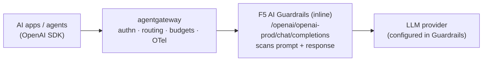
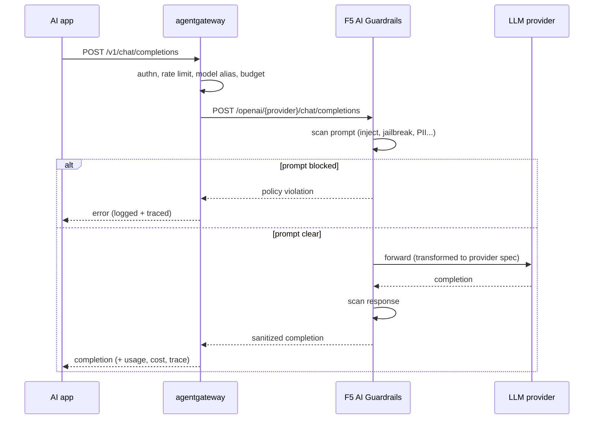
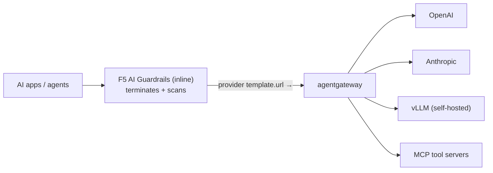
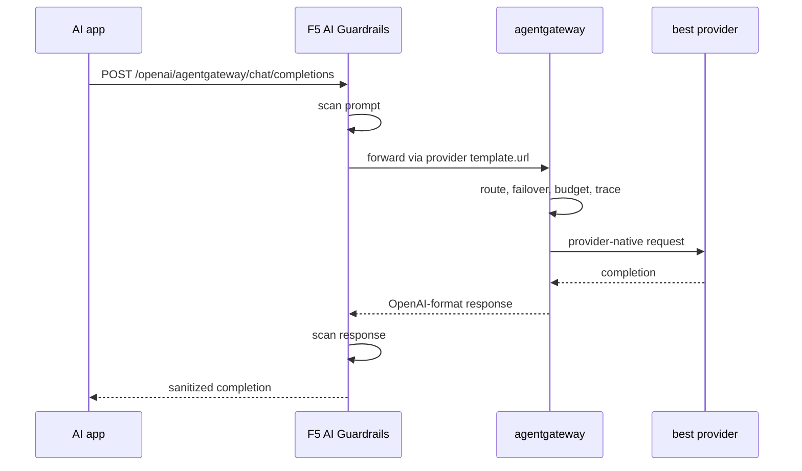
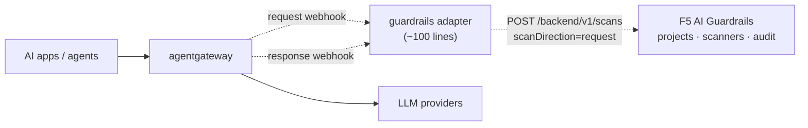
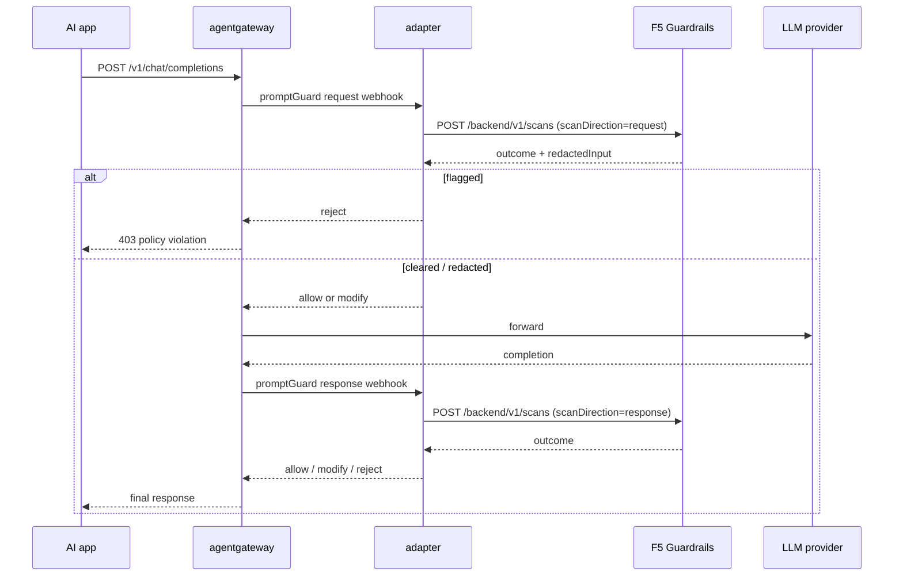
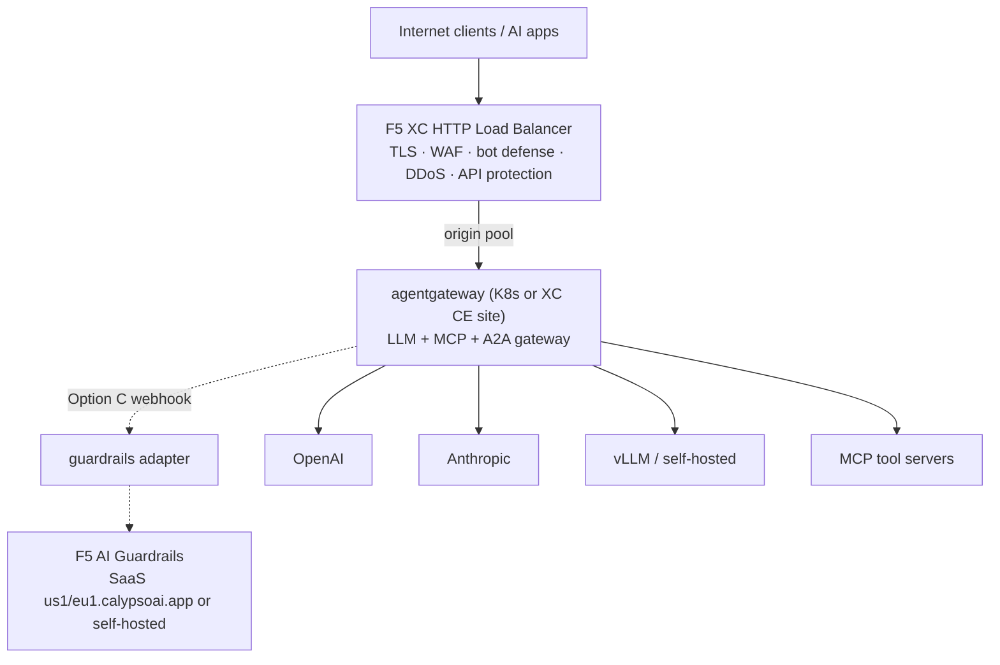

F5's acquisition of CalypsoAI gave enterprises something a lot of security
teams have been asking for: a dedicated AI runtime security layer — **F5 AI
Guardrails** — that scans prompts and responses against policy (prompt
injection, jailbreaks, PII, data exfiltration) independently of whichever
model or app framework is behind it. Meanwhile, platform teams are
standardizing on **agentgateway** as the data plane for LLM, MCP, and A2A
traffic: one OpenAI-compatible front door with routing, failover, auth, spend
limits, and OpenTelemetry.

So the obvious question came up — in my case, from an enterprise that already
runs its web estate behind F5 Distributed Cloud (XC): **can these two coexist,
and who sits in front of whom?**

Short answer: yes, and there are three workable architectures. I verified the
key API surfaces against the live F5 docs ([docs.aisecurity.f5.com](https://docs.aisecurity.f5.com/)
— note that `docs.calypsoai.com` now redirects there) rather than assuming,
because the whole design hinges on two questions:

1. Does Guardrails expose an **OpenAI-compatible inline endpoint**? *(Yes:
   `POST /openai/{provider}/chat/completions`.)*
2. Can you **override the backend URL** Guardrails forwards to? *(Yes:
   providers are created with `POST /backend/v1/providers` and carry a
   `template.url` — an arbitrary endpoint.)*

That second one matters because it decides whether "agentgateway behind F5"
is even possible. It is. Let's walk through all three options.

## First, get the product boundaries right

One thing that trips people up: **F5 AI Guardrails is not an F5 XC feature.**
It's the CalypsoAI platform under F5 branding — its own console, its own
projects and API tokens, delivered as SaaS (`us1.calypsoai.app` /
`eu1.calypsoai.app`) or self-hosted on Kubernetes/OpenShift. Your XC tenant
gives you the WAAP edge (TLS, WAF, bot defense, DDoS, API protection); the
Guardrails license is separate.

The three products in play:

| Layer | Product | Job |
|---|---|---|
| Edge | F5 Distributed Cloud HTTP LB | Public entry: TLS, WAF, bot defense, DDoS |
| AI data plane | agentgateway | OpenAI-compatible routing, failover, authn, budgets, MCP/A2A, OTel |
| AI security | F5 AI Guardrails (ex-CalypsoAI) | Prompt/response scanning: inject, jailbreak, PII, custom scanners |

Guardrails itself supports two consumption modes, and every architecture below
is a composition of them:

- **Inline** — Guardrails terminates the request, scans, and forwards to a
  configured provider. Speaks its native PromptAPI (`POST /backend/v1/prompts`)
  *or* plain OpenAI chat completions (`POST /openai/{provider}/chat/completions`).
- **Out-of-band** — a pure verdict API. `POST /backend/v1/scans` takes
  `input`, `project`, and `scanDirection` (`request` or `response`) and returns
  an outcome plus `redactedInput`. Nothing gets forwarded; *you* stay in charge
  of calling the model.

## Option A — agentgateway in front of Guardrails

The zero-code option. Guardrails' inline endpoint is OpenAI-compatible, so
agentgateway just treats it as one more LLM backend. F5 makes the final hop to
the provider.



The flow, end to end:



Configuration is just a custom OpenAI-compatible backend in agentgateway
pointing at the Guardrails host, with the CalypsoAI token as backend auth. The
same mechanics F5 documents for pointing the raw OpenAI SDK at Guardrails
(`base_url = "{BASE_URL}/openai/{CONNECTION_NAME}"`) apply — agentgateway is
simply the client.

**Choose this when** the security team owns model access end-to-end and you
want the fastest possible integration. **Trade-off:** the *final* provider
choice lives in Guardrails' provider config, so agentgateway's multi-provider
failover happens between Guardrails connections rather than directly against
the LLMs.

## Option B — agentgateway behind Guardrails

The reverse: Guardrails is the client-facing boundary and delegates the actual
model plumbing to agentgateway. This only works if you can override the
endpoint Guardrails forwards to — and you can. A Guardrails **provider** is
defined by a request template with a `url`, `method`, `headers`, and body
mapping, so you point that template at agentgateway's OpenAI-compatible
listener:

```json
POST /backend/v1/providers
{
  "name": "agentgateway",
  "template": {
    "type": "request",
    "url": "https://agw.internal.example.com/v1/chat/completions",
    "method": "POST",
    "headers": { "Authorization": "Bearer {{agw_token}}" }
  },
  "secrets": { "agw_token": "..." },
  "projectId": "<guardrails-project>"
}
```





**Choose this when** the security team insists on owning the client-facing
endpoint, but you still want gateway-grade routing/failover/spend control
underneath the guardrail check. **Trade-off:** the provider-template mechanism
is documented, but chaining it into another gateway isn't an F5-published
pattern — validate streaming pass-through and tool/function-call payloads in a
spike before committing.

## Option C — out-of-band: agentgateway calls Guardrails as a scanner

My favorite long-term shape. agentgateway stays the single inference path and
invokes Guardrails' ScanAPI as a side-scan in both directions, using
agentgateway's **webhook prompt guards**. Guardrails never proxies anything;
it just renders verdicts. The only code you write is a thin adapter
(~100 lines) that translates agentgateway's webhook contract to
`POST /backend/v1/scans`:

- Guardrails outcome = flagged → webhook **rejects** (client gets a 4xx)
- Guardrails returns `redactedInput` → webhook **modifies** (masked content
  goes forward)
- otherwise → **allow**





Wiring it up on the agentgateway side is a policy targeting your LLM route:

```yaml
apiVersion: enterpriseagentgateway.solo.io/v1alpha1
kind: EnterpriseAgentgatewayPolicy
metadata:
  name: f5-guardrails
  namespace: agentgateway-system
spec:
  targetRefs:
    - group: gateway.networking.k8s.io
      kind: HTTPRoute
      name: llm-route
  backend:
    ai:
      promptGuard:
        request:
          - webhook:
              backendRef: { kind: Service, name: f5-guardrails-adapter, port: 8000 }
        response:
          - webhook:
              backendRef: { kind: Service, name: f5-guardrails-adapter, port: 8000 }
```

**Choose this when** you want agentgateway to keep full provider control
(failover, streaming straight from the provider, budgets) while the security
team keeps full policy control in the Guardrails console — clean separation of
planes, one hop fewer on the token stream. **Trade-off:** you own the adapter,
and scanning *streamed* responses forces a buffering decision
(scan-on-complete vs. chunked) that you should prototype early. If this
pattern spreads, the natural product evolution is native F5 ScanAPI support in
agentgateway's guardrail family, right next to Bedrock Guardrails and Model
Armor.

## The full picture: F5 XC on the edge

If you already run F5 Distributed Cloud, the AI stack slots in behind it the
same way your web properties do. XC doesn't host Guardrails — it contributes
the hardened public edge, and an origin pool pointing at agentgateway:



Every layer does the one thing it's best at: XC absorbs the internet,
agentgateway governs AI traffic, Guardrails judges content. And each layer is
independently swappable — which is exactly what you want when this space is
moving as fast as it is.

## Choosing between them

| | A: agw → F5 | B: F5 → agw | C: out-of-band |
|---|---|---|---|
| Code required | none | none | small adapter |
| Client-facing endpoint | agentgateway | Guardrails | agentgateway |
| Provider routing/failover | in Guardrails | in agentgateway | in agentgateway |
| Extra proxy hop on token stream | yes | yes | no (verdicts only) |
| Streaming risk | F5-documented | needs spike | buffering choice on response scan |
| Best for | fastest PoC | security-team-owned front door | production, clean separation of planes |

My recommendation: **prove Option A in an afternoon** (it's configuration
only), then **build Option C for production**. Option B is the niche play for
orgs whose security team must terminate the client connection.

## References

- [F5 AI Guardrails API docs](https://docs.aisecurity.f5.com/) — [getting started with Defend](https://docs.aisecurity.f5.com/api-docs/getting-started-defend.html), [ScanAPI](https://docs.aisecurity.f5.com/operations/post_scans.html), [providers](https://docs.aisecurity.f5.com/operations/post_providers.html), [OpenAI-compatible endpoint](https://docs.aisecurity.f5.com/operations/post_openai_provider_chat_completions.html), [OpenAI SDK proxy integration](https://docs.aisecurity.f5.com/integrations/proxy.openai-sdk.html)
- [F5 AI security API integration examples (GitHub)](https://github.com/f5devcentral/f5-ai-security-api-integration-examples)
- [agentgateway docs](https://docs.solo.io/agentgateway/latest/) — [custom providers](https://docs.solo.io/agentgateway/latest/llm/providers/custom/), [webhook guardrails](https://docs.solo.io/agentgateway/latest/llm/guardrails/webhook/)
- [F5 XC EMEA workshop, Class 6 Module 1](https://clouddocs.f5.com/training/community/f5xc-emea-workshop/html/class6/module1/module1.html) — Lab 2 (inline), Lab 3 (out-of-band)
