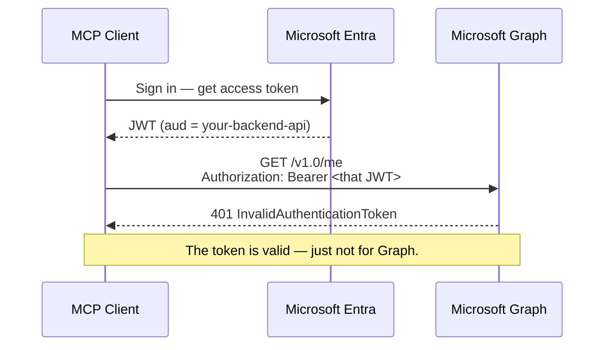
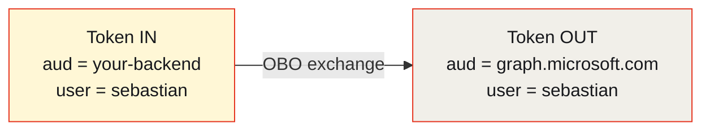
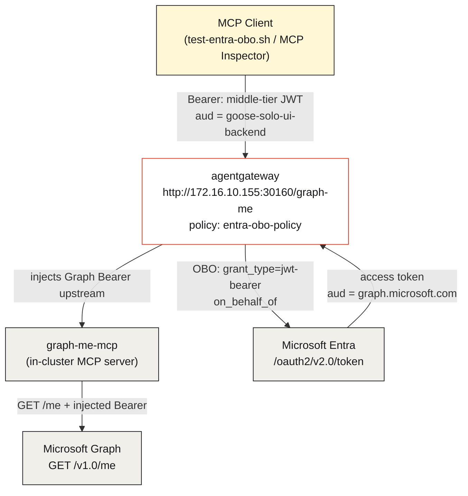
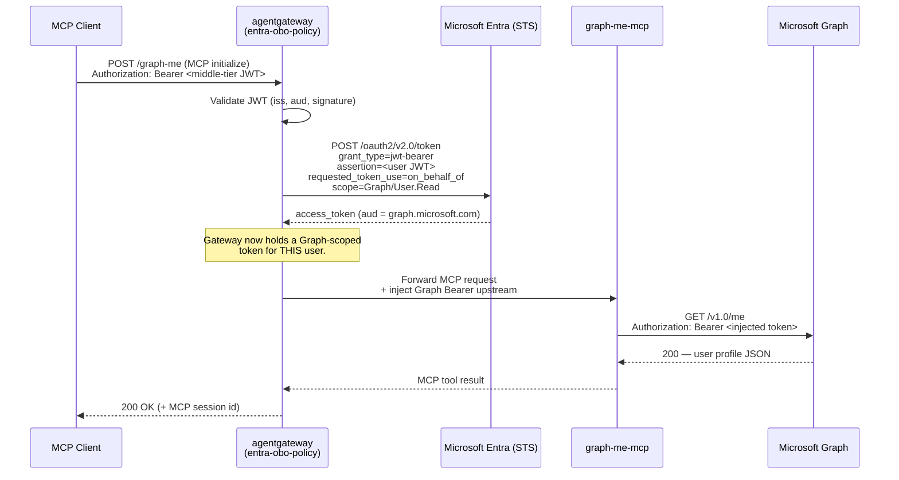

There's a moment in almost every enterprise integration where you have *a* token, but not *the* token. You're holding a perfectly valid JWT that your identity provider signed — your user is authenticated, the claims are real — and yet the API you need to call rejects it with a flat `401`. Nothing is wrong with the token. It's just addressed to someone else.

That's the problem the **OAuth 2.0 On-Behalf-Of (OBO)** flow was invented to solve, and it's the story this article tells. We'll use a small, real lab: an MCP client holding an Entra (Azure AD) token, an [Enterprise agentgateway](https://agentgateway.dev) acting as the broker, and Microsoft Graph as the downstream API. By the end you'll understand *why* OBO exists, *how* the exchange actually works on the wire, and *how to* configure the gateway to do it for you — all reproducible with a single script, [`test-entra-obo.sh`](https://github.com/sebbycorp/k8s-goose/blob/main/scripts/test-entra-obo.sh).

## The 401 that starts everything

Let's begin with the failure, because the failure is what makes OBO make sense.

Your MCP client signs in a user through your corporate IdP and receives an access token. It's a bearer token — you'd be forgiven for assuming you can now take it and call any Microsoft API. So you try the obvious thing: send it straight to Graph.



The token is cryptographically sound. Entra signed it. The user is who they say they are. But Graph looks at one field and stops reading: **`aud`**, the audience.

## Why the audience matters (the whole story in one claim)

Every access token carries an audience claim that names *who the token is for*. When Entra minted your token, you asked for a token scoped to **your own backend API** — an app registration with the ID `0c00f6d2-5587-469d-9d35-7360d878fddc`, in this lab called `goose-solo-ui-backend`. So the token says, in effect:

> "This bearer is authorized to talk to `0c00f6d2-…`, on behalf of `sebastian@maniak.io`."

Microsoft Graph's audience is `https://graph.microsoft.com`. When Graph receives a token whose `aud` is your backend, it correctly refuses it — a token for one audience must **never** be accepted by another. That rule isn't bureaucratic; it's the thing that stops a token you handed to one service from being replayed against a completely different one. Audience scoping is a security feature, and OBO is how you work *with* it instead of against it.

Here is the token the client actually holds, decoded (this is real output from the demo's `token` mode):

```text
iss      : https://login.microsoftonline.com/8635e970-…/v2.0
aud      : 0c00f6d2-5587-469d-9d35-7360d878fddc   ← your backend, NOT Graph
sub/oid  : ed1b752d-d99c-421f-afc3-a6ebc323cd27
user     : sebastian@maniak.io
scp      : access_as_user
azp      : 04b07795-8ddb-461a-bbee-02f9e1bf7b46
```

The star of the show is `aud`. It points at the middle tier. Graph would look at it and hand back `InvalidAuthenticationToken`. **We need a token with `aud = https://graph.microsoft.com` — but we need it to still represent the same signed-in user.** That is precisely what OBO produces.

## What On-Behalf-Of actually is

OBO is a *token exchange*. A middle-tier service (the "confused deputy" in older literature, here our gateway) takes the user's token, presents it back to the identity provider as proof, and asks: *"The user already authorized me. Now mint me a new token — for a different downstream API — that still acts on this same user's behalf."*

The IdP validates the incoming token, checks that the middle tier is allowed to request the downstream scope, and issues a brand-new token with the **downstream audience** and the **same user identity**. The user never re-authenticates. The downstream API never sees the original token. And — the part that matters for MCP servers — **the thing that performs the exchange holds the client secret; the code that calls Graph does not.**



Same user. New audience. That single transformation is the entire point.

## The lab: who is who

Before the flow, meet the cast. The whole demo is three network hops wide.



| Actor | Role | What it holds |
|---|---|---|
| **MCP client** | Starts the request | A middle-tier Entra JWT (`aud = goose-solo-ui-backend`) |
| **agentgateway** | The broker | The app **client secret**, and the OBO policy |
| **Microsoft Entra** | Security token service | The signing keys; issues the exchanged token |
| **graph-me-mcp** | Downstream MCP server | *Nothing* — it receives an injected Graph token |
| **Microsoft Graph** | The protected API | Validates `aud = https://graph.microsoft.com` |

The crucial design property: the **client** never holds a Graph token, and the **MCP server** never holds the client secret. The gateway sits in the middle and is the only party that touches both.

## The full flow, end to end

Now the whole thing on one wire diagram. This is what happens on the very first MCP call.



Read it top to bottom and the story is complete: a token that Graph would reject goes in the top; a real Graph profile comes out the bottom; the exchange in the middle is the only thing that changed, and it happened inside the gateway.

## How to do it: the gateway configuration

The behavior above is declarative. Three small YAML objects wire it up — a **policy** that describes the exchange, a **backend** that points at the MCP server, and a **route** that binds a path to them. These mirror the config referenced by the demo (`config/policies/…`, `config/backends/…`, `config/routes/…`).

### 1. The OBO policy

This is where the exchange lives. The key block is `tokenExchange.entra`, and the key setting is `mode: ExchangeOnly` — meaning "just do the OBO swap, no interactive elicitation UI."

```yaml
# config/policies/entra-obo-policy.yaml
apiVersion: gateway.agentgateway.dev/v1alpha1
kind: Policy
metadata:
  name: entra-obo-policy
spec:
  tokenExchange:
    entra:
      mode: ExchangeOnly            # do the OBO swap; no elicitation prompt
      tenantId: 8635e970-2205-4189-bc77-77519ff5064f
      clientId: 0c00f6d2-5587-469d-9d35-7360d878fddc   # the middle-tier app
      clientSecretRef:
        name: entra-obo-secret       # the app secret — lives ONLY here
        key: client-secret
      scope: https://graph.microsoft.com/User.Read      # downstream audience+scope
```

Everything security-sensitive is contained in this one object: the tenant, the app that's allowed to perform the exchange, the secret that proves it, and the exact downstream scope being requested. Nothing downstream needs any of it.

### 2. The MCP backend

The backend declares the in-cluster MCP server that will receive the injected token.

```yaml
# config/backends/graph-me-mcp.yaml
apiVersion: gateway.agentgateway.dev/v1alpha1
kind: Backend
metadata:
  name: graph-me-mcp
spec:
  mcp:
    targets:
      - name: graph-me
        service:
          host: graph-me-mcp.default.svc.cluster.local
          port: 8080
```

### 3. The route

The route ties a public path to the backend and applies the policy. This is what makes `POST /graph-me` do OBO.

```yaml
# config/routes/graph-me-mcp-route.yaml
apiVersion: gateway.agentgateway.dev/v1alpha1
kind: HTTPRoute
metadata:
  name: graph-me-mcp-route
spec:
  rules:
    - matches:
        - path:
            type: PathPrefix
            value: /graph-me
      filters:
        - type: Policy
          policy: entra-obo-policy
      backendRefs:
        - name: graph-me-mcp
```

That's the whole surface area. Add a path, attach a policy, point at a backend — the gateway handles the token dance.

## Watching it run: the five steps of the demo

The [`test-entra-obo.sh`](https://github.com/sebbycorp/k8s-goose/blob/main/scripts/test-entra-obo.sh) script narrates the exact flow above in five steps. Here's what each one proves.

### Step 1 — Mint the middle-tier token (what the client holds)

The script asks Entra for a token whose audience is the **middle-tier API**, not Graph:

```bash
az account get-access-token --resource api://0c00f6d2-5587-469d-9d35-7360d878fddc
```

```text
aud      : 0c00f6d2-5587-469d-9d35-7360d878fddc   ← middle-tier, not Graph
user     : sebastian@maniak.io
scp      : access_as_user
★ this token is MIDDLE-TIER scoped — Graph would 401 it.
```

**Teaching point:** if we sent this straight to Graph, we'd get the `401` we opened with. OBO exists so the gateway can swap it first.

### Step 2 — MCP `initialize` (the exchange fires here)

```text
POST http://172.16.10.155:30160/graph-me
Authorization: Bearer <middle-tier JWT>
→ HTTP/1.1 200 OK (456 ms)
  server   : graph-me-mcp v1.0.0
  protocol : 2025-03-26
  session  : eyJ0IjoibWNwI… (send this on every later call)
```

On this call the gateway validates the JWT, calls Entra's `/oauth2/v2.0/token` with the OBO grant, and caches a Graph-scoped token for the upstream. The client sees only a normal MCP handshake and a session id.

### Step 3 — `tools/list`

```text
• graph_me
    Call Microsoft Graph GET /me using the bearer token
    injected by agentgateway after the Entra OBO exchange.
```

Same middle-tier bearer from the client; the gateway silently reuses the exchanged Graph token upstream.

### Step 4 — `tools/call graph_me` (OBO in action)

The MCP server's code is almost embarrassingly simple — that's the point:

```text
GET https://graph.microsoft.com/v1.0/me
Authorization: Bearer <token agentgateway injected>
```

```text
Graph /me profile:
  displayName        sebastian
  mail               sebastian@maniak.io
  userPrincipalName  sebastian@maniak.io
  id                 ed1b752d-d99c-421f-afc3-a6ebc323cd27
```

Real profile fields, returned by Graph, for the signed-in user. That could only happen if the upstream token's `aud` was `https://graph.microsoft.com` — which proves the exchange worked.

### Step 5 — Summary

```text
✓ OBO SUCCESS  Graph /me → sebastian sebastian@maniak.io
```

The client never held a Graph token. The MCP server never held the app secret. The gateway bridged the two.

## Where OBO fits among the other patterns

This lab exposes three paths that look similar but solve different problems. Knowing which is which is half of understanding OBO.

| Path | What it does | Token exchange? |
|---|---|---|
| **`/graph-me`** | Entra On-Behalf-Of — swap user token for a Graph token | ✅ Yes (this article) |
| **`/mcp-secure`** | Entra JWT validation + tool-level RBAC only | ❌ No — same token forwarded |
| **`/github-elicit`** | Interactive elicitation / third-party OAuth store | ❌ No — user grants a *new* consent |

The distinction that trips people up is `/mcp-secure` vs `/graph-me`. Both start from a valid Entra JWT. But `/mcp-secure` just *checks* the token and lets it through (fine when the downstream trusts the same audience). `/graph-me` *transforms* it — and you need that transformation precisely when the downstream audience differs, as Graph's always will.

## Why route OBO through a gateway at all?

You could implement OBO inside every MCP server. The reason not to is the same reason you don't put TLS termination or rate limiting in every service:

- **Secret containment.** The client secret lives in exactly one place — the gateway's policy. Your MCP servers become dumb HTTP callers that trust an injected header. If one is compromised, no exchange credential leaks with it.
- **Uniformity.** Every backend that needs a Graph token gets it the same way, by attaching one policy. No per-service OAuth libraries, no drift.
- **Auditability.** Every exchange happens at one chokepoint you can log, meter, and reason about.
- **Blast radius.** Rotate the secret, change the scope, or revoke the whole path in one config object — not across a fleet of services.

The MCP server in this demo does one thing: `GET /me` with whatever bearer it was handed. That simplicity is the *product* of pushing OBO into the gateway.

## Run it yourself

```bash
# full narrated demo
./scripts/test-entra-obo.sh

# just decode and show the middle-tier token
./scripts/test-entra-obo.sh token

# quiet mode
QUIET=1 ./scripts/test-entra-obo.sh
```

## The one thing to remember

A valid token is not a universal token. Its audience pins it to one destination, on purpose. **On-Behalf-Of is the sanctioned way to cross that boundary** — a middle tier proves the user already consented, and the IdP re-mints the identity for a new audience without a second login. Put that exchange in agentgateway and you get the best of both worlds: downstream services stay simple and secretless, while the one component that *does* hold the secret is the one you can watch, rotate, and lock down.

The client never sees Graph. The server never sees the secret. The gateway sees both, briefly, and only to trade one true token for another.
