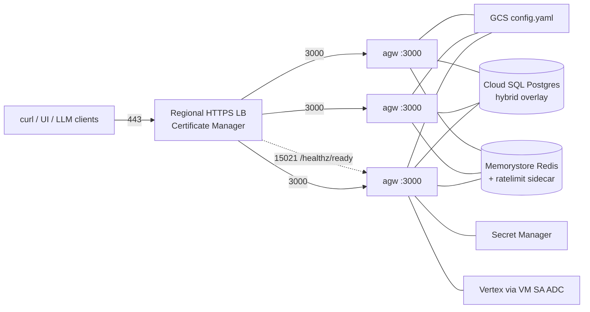

Most of what I've written about [agentgateway](https://agentgateway.dev) lands on Kubernetes. This one doesn't.

I wanted a **three-node HA fleet** of [Solo Enterprise for agentgateway](https://docs.solo.io/agentgateway/standalone/latest/) that I could treat like any other GCE workload: a regional managed instance group, a regional HTTPS load balancer, private VMs, and no cluster to babysit. Docker on Debian. That's it.

GKE is the right answer when you already have a cluster and you want Helm to own the rollout. For this lab I wanted the opposite — prove the [standalone Docker path](https://docs.solo.io/agentgateway/standalone/latest/setup/install/docker/) can sit behind GCP's own primitives and still look like one hostname.

Everything below is from a real apply in project `maniak-io`, region `us-central1`, on **September 10, 2026**. The screenshots are from that run. The how-to lives in [`15-standalone-gcp-ha`](https://github.com/sebbycorp/agentgateway-demos/tree/main/15-standalone-gcp-ha).

The public door is `https://agw-gcp-ha.maniak.io`.

---

## What we're actually here to do

Stand up three private GCE VMs. Each one runs the published enterprise image. A regional HTTPS load balancer is the only thing the internet can see. Config comes from a versioned GCS object. State that has to be shared — the UI overlay, the request log — lives in Cloud SQL. Rate-limit counters live in Memorystore. The license never touches git.

| Piece | This apply |
|-------|------------|
| **Image** | `us-docker.pkg.dev/solo-public/enterprise-agentgateway/agentgateway-enterprise:2026.8.2` |
| **Ratelimit sidecar** | `envoyproxy/ratelimit:v1.4.0` |
| **Hostname** | `agw-gcp-ha.maniak.io` (Cloud DNS zone `maniak` / `maniak.io.`) |
| **MIG** | `agw-gcp-ha`, size 3, even across `us-central1-a/b/c` |
| **Data port** | `3000` (named port `http` on the backend) |
| **Readiness** | `:15021` `/healthz/ready` — not `/readyz` |
| **Admin** | `127.0.0.1:15000` on each VM. Not the front door. |

Don't float `:latest`. Pin the tag, roll the MIG when you bump it.

---

## The shape of it



| Hop | What happens |
|-----|----------------|
| **1 · Edge** | Regional external HTTPS LB. Certificate Manager issues the cert with DNS authorization. Cloud DNS points `agw-gcp-ha.maniak.io` at the forwarding rule. |
| **2 · Fleet** | Three private Debian 12 VMs in MIG `agw-gcp-ha`. No public IPs. Egress is Cloud NAT. IAP + OS Login is how you get a shell. |
| **3 · Process** | Docker, host network. Enterprise container on `:3000`. Envoy ratelimit sidecar on localhost talking to Memorystore. |
| **4 · Shared state** | GCS is the file baseline. Cloud SQL is [`storage.mode: hybrid`](https://docs.solo.io/agentgateway/standalone/latest/setup/storage/) plus the [database](https://docs.solo.io/agentgateway/standalone/latest/setup/database/). Memorystore holds [remote rate-limit](https://docs.solo.io/agentgateway/standalone/latest/configuration/resiliency/rate-limits/) counters. |
| **5 · Identity / models** | Google Identity Platform (email/password on this apply). Vertex uses the VM service account and ADC — no API key in the YAML. See [GCP / Vertex](https://docs.solo.io/agentgateway/standalone/latest/integrations/cloud-providers/gcp/). |

Three processes, one hostname. The VIP drops a backend that fails `/healthz/ready`. That is HA here. It is not a clustered dataplane, and I won't pretend otherwise.

---

## License and secrets stay out of git

The enterprise proxy [refuses to start](https://docs.solo.io/agentgateway/standalone/latest/setup/license/) without a valid key. The check is the whole operational difference from OSS.

The key is **never** in the repo. I export it in my shell and Terraform writes Secret Manager. There is no Terraform output of the raw value.

```bash
export TF_VAR_agentgateway_license_key   # shell only; never commit
# or the name the container actually reads:
export ENTERPRISE_AGENTGATEWAY_LICENSE_KEY
```

Startup on each VM pulls four secrets into a `0600` env file and passes `ENTERPRISE_AGENTGATEWAY_LICENSE_KEY` into the container. The names from this apply — values never shown:

- `agw-gcp-ha-license-key`
- `agw-gcp-ha-session-key`
- `agw-gcp-ha-database-url`
- `agw-gcp-ha-idp-client-secret`

`.gitignore` already blocks `.env`, `*.auto.tfvars`, `secrets*.tfvars`, and tfstate. Don't invent a fifth place to paste the key.

---

## What Terraform creates

Short list. The files are under [`15-standalone-gcp-ha/terraform`](https://github.com/sebbycorp/agentgateway-demos/tree/main/15-standalone-gcp-ha/terraform).

- VPC, private subnet `10.10.0.0/20`, proxy-only subnet for the regional Application LB, Cloud NAT, IAP and LB firewalls
- VM service account with `secretmanager.secretAccessor`, `storage.objectViewer`, `aiplatform.user`, plus logging/monitoring write
- Secret Manager for license, hex session key, Postgres URL, IdP client secret
- Versioned GCS bucket: `config.yaml`, `model-costs.json`, `ratelimit.yaml`
- Cloud SQL Postgres 16, Enterprise, `db-custom-1-3840`, private IP via Private Service Access
- Memorystore Redis 7.0, 1 GB, for the ratelimit sidecar
- Regional MIG of 3, Debian 12, Docker startup, auto-heal on `:15021 /healthz/ready`
- Regional HTTPS LB, Certificate Manager, Cloud DNS A record
- Identity Platform project config (email sign-in)

Each VM is cattle. Postgres is not. Hybrid mode needs a database URL or the process won't start — Solo is explicit about that on the [storage](https://docs.solo.io/agentgateway/standalone/latest/setup/storage/) page. One SQLite file on three VMs is not HA. NFS does not make it legal.

---

## Three things this image taught me

I tripped on all three during the apply. Writing them down so you don't.

**`/readyz` is the wrong readiness path on Enterprise 2026.8.2.** The listener is `:15021`. The path that actually answers is `/healthz/ready`. Point the MIG auto-heal and the LB health check at that, or the group never goes green.

**`SESSION_KEY` must be hex.** `openssl rand -hex 32`. An alphanumeric `random_password` comes back as an invalid character. Terraform on this lab uses `random_id` and stores `.hex`.

**`AGW_NODE_ID` has to be the GCE instance name.** The numeric instance id looks convenient and then breaks string fields in YAML and headers. Metadata `instance/name` is what `/whoami` prints — `agw-gcp-ha-fgtx`, not a number.

---

## Apply, then look at the console

You need ADC, a quota project, and a license in the environment. Preflight spends nothing and does not print the key.

```bash
cd 15-standalone-gcp-ha
export LAB_GCP_PROJECT=maniak-io
export TF_VAR_agentgateway_license_key   # or ENTERPRISE_AGENTGATEWAY_LICENSE_KEY
./scripts/00-preflight.sh
./scripts/01-apply.sh
./scripts/02-verify.sh
```

Preflight's cost line is the only number I'll repeat: **a few dollars per hour while the stack is up.** Tear it down when you're done.

`01-apply.sh` forwards the license as `TF_VAR` and never echoes it. When it finishes it prints the whoami URL. `02-verify.sh` checks that the MIG has three instances and that `https://agw-gcp-ha.maniak.io/whoami` returns JSON with a node name.

This apply: MIG `agw-gcp-ha` came up **Ready**, target size 3, **100% healthy**, health check `agw-gcp-ha-mig-ready`. Created September 10, 2026. Template `agw-gcp-ha-2026091019524971000001`. Location `us-central1` (3/4).


The load balancer health check is a separate object — `agw-gcp-ha-ready`, port **15021**, timeout 5s, interval 10s, healthy after 2, unhealthy after 3. All three backends were healthy:

| Instance | Zone | Private IP |
|----------|------|------------|
| `agw-gcp-ha-fgtx` | `us-central1-a` | `10.10.0.4` |
| `agw-gcp-ha-k34b` | `us-central1-b` | `10.10.0.2` |
| `agw-gcp-ha-b2jn` | `us-central1-c` | `10.10.0.3` |


Cloud SQL instance `agw-gcp-ha-pg`: PostgreSQL **16.15**, Enterprise, 1 vCPU / 3.75 GB, `us-central1`, single zone. That's the hybrid overlay and the request log. Schema shows up on the first agentgateway start, not when you create the empty database.


Memorystore instance `agw-gcp-ha-redis`: Redis **7.0**, 1 GB, `us-central1`, primary `10.224.110.236:6379`. Each VM's ratelimit sidecar talks to that address; agentgateway talks to `127.0.0.1:8081`.


Secret Manager, names only. Google-managed encryption, `goog-terraform:true` on each row. Do not open the versions in a screenshot.


Identity Platform on this apply: Email / Password on, Anonymous off. JWT issuer in config is `https://securetoken.google.com/maniak-io`. The UI confidential OAuth client (redirect `https://agw-gcp-ha.maniak.io/oauth/callback`) is a console step if Terraform can't represent it — the lab README has the appendix.


`/whoami` is an in-process `directResponse`. No upstream. It exists so I can see the load balancer actually fan out across zones. The apply screenshot landed on the `us-central1-a` VM:

```json
{"node":"agw-gcp-ha-fgtx","zone":"us-central1-a","ip":"10.10.0.4"}
```


I hit the same URL again while writing this. The other two names showed up too — `agw-gcp-ha-k34b` in `us-central1-b` (`10.10.0.2`) and `agw-gcp-ha-b2jn` in `us-central1-c` (`10.10.0.3`). That's the whole proof.

---

## Ops notes

No public SSH. IAP tunnel:

```bash
gcloud compute ssh INSTANCE \
  --tunnel-through-iap \
  --project=maniak-io \
  --zone=ZONE
```

Admin stays on loopback inside the container's network namespace — host network, so `127.0.0.1:15000` on the VM is the process. Don't publish it.

```bash
curl -s http://127.0.0.1:15000/config_dump | jq .
```

Config sync is boring on purpose. The baseline lives in GCS. A cron on each node copies `config.yaml` (and the cost catalog, and the ratelimit yaml) about once a minute. Gateways, routes, `llm`, `mcp`, `ui` reload live. Listen addresses, the session key, the database URL, and storage mode do not — those are startup-only.

UI edits go to Cloud SQL. Siblings converge because they share the overlay. Push a file change to GCS if you want the baseline itself to move.

Vertex does not get a key in the YAML. The VM service account is `roles/aiplatform.user`. ADC is the default for the `vertex` provider. That's the [GCP page](https://docs.solo.io/agentgateway/standalone/latest/integrations/cloud-providers/gcp/).

---

## Tear it down

This stack costs a few dollars per hour while it is up. Don't leave it as furniture.

```bash
./scripts/teardown.sh
```

That runs `terraform destroy` and then sweeps leftover forwarding rules and addresses tagged `agw-gcp-ha`. Confirm the MIG, the SQL instance, and Memorystore are actually gone before you walk away.

Rotate anything that ended up in a ticket. Don't commit a `license.env`. Don't paste Secret Manager values into a screenshot.

---

## The takeaway

Standalone Enterprise is one process and one config file. HA on GCE is three of those processes, a load balancer that health-checks `/healthz/ready`, and a Postgres that outlives any one VM. Docker is how the process gets onto the box. Kubernetes is optional.

I ran it in `maniak-io`. The console shots are from that apply. `/whoami` I hit again while writing — same JSON shape, different node. The repo is the runbook.

👉 Lab folder: **[sebbycorp/agentgateway-demos / 15-standalone-gcp-ha](https://github.com/sebbycorp/agentgateway-demos/tree/main/15-standalone-gcp-ha)**

---

## Further reading

- Lab: [15-standalone-gcp-ha](https://github.com/sebbycorp/agentgateway-demos/tree/main/15-standalone-gcp-ha)
- Install (Docker): [setup/install/docker](https://docs.solo.io/agentgateway/standalone/latest/setup/install/docker/)
- License: [setup/license](https://docs.solo.io/agentgateway/standalone/latest/setup/license/)
- GCP / Vertex: [integrations/cloud-providers/gcp](https://docs.solo.io/agentgateway/standalone/latest/integrations/cloud-providers/gcp/)
- Storage (`file` vs `hybrid`): [setup/storage](https://docs.solo.io/agentgateway/standalone/latest/setup/storage/)
- Database (SQLite vs PostgreSQL): [setup/database](https://docs.solo.io/agentgateway/standalone/latest/setup/database/)
- Rate limits: [configuration/resiliency/rate-limits](https://docs.solo.io/agentgateway/standalone/latest/configuration/resiliency/rate-limits/)
- Related: [How To: Run agentgateway standalone locally](/articles/2026-03-12-agentgateway-quickstart-standalone/)
- Related: [Integration: Solo Enterprise on VMware vSphere with HA](/articles/2026-09-10-solo-enterprise-agentgateway-standalone-on-vmware-rhel/)
- Related: [What is agentgateway.dev?](/articles/2026-03-12-what-is-agentgateway-dev/)
