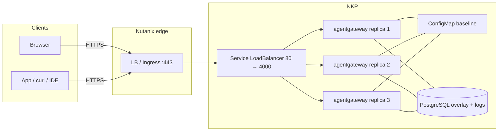

Most of what I've written about [agentgateway](https://agentgateway.dev)
assumes Kubernetes. This post is the Nutanix version of that sentence.

What we're building is
[Solo Enterprise for agentgateway](https://docs.solo.io/agentgateway/standalone/latest/)
in **standalone mode**, running on infrastructure you already own:
**Nutanix Kubernetes Platform (NKP)** for anything real, and an AHV guest
only if what you want is a lab.

- One process per replica
- One config file as the baseline
- No enterprise control plane
- No custom resources

You get the same enterprise features as Kubernetes mode — high
availability just comes from running several replicas against a shared
PostgreSQL, rather than from a second product you have to invent.

I'm pinning **2026.9.0** / **v2026.9.0**, the latest-stream release that
[adds standalone mode](https://docs.solo.io/agentgateway/standalone/latest/release-notes/release-notes/).
The current LTS streams are Kubernetes-mode only, so stay on latest until
the next LTS lands — Solo expects that around October.

One thing to be clear about up front: the Nutanix layout below is **how I
would integrate it**, not a joint Solo–Nutanix guide. No such guide
exists. The image, chart, license, storage, and ports all come from
Solo's public standalone docs, and if a command here ever disagrees with
that page, believe
[docs.solo.io](https://docs.solo.io/agentgateway/standalone/latest/).

Once the production path is up, clients hit a single VIP and the cluster
keeps more than one proxy behind it:

| Address | Who uses it | Notes |
|---------|-------------|-------|
| `https://<vip>/ui` | You, in a browser | TLS on the Nutanix LB / Ingress; the backend is gateway **4000** (the Service maps **80 → 4000**) |
| `https://<vip>/...` | Apps, `curl`, IDEs | The same Service. Add routes and policies in Helm values or the UI overlay |
| `:15000` | Operators on a port-forward | Admin is loopback inside each pod. It is not the front door |

## Before you start

Here's what you'll need:

- A **Solo Enterprise for agentgateway license key**. The proxy
  [refuses to start](https://docs.solo.io/agentgateway/standalone/latest/setup/license/)
  without a valid one, so sort this out first. The placeholder everywhere
  below is `<license-key>`.
- **NKP** — or whatever Kubernetes it happens to be wrapping — if you
  want the production path, along with `kubectl`, `helm`, and a
  StorageClass that can back PostgreSQL.
- A **PostgreSQL** instance you're willing to look after. Solo is
  explicit about this: more than one replica means PostgreSQL, not a
  shared SQLite file. And production means a **PersistentVolumeClaim or a
  managed instance**, not `emptyDir`.
- Somewhere to keep the license that **isn't git** — a Kubernetes Secret
  on NKP, or a `600`-mode `.env` on an AHV lab VM.

The enterprise image and the standalone chart both sit on a
[public registry](https://docs.solo.io/agentgateway/standalone/latest/setup/install/helm/),
so you won't need pull credentials unless you've mirrored them.

## What standalone mode is

[Standalone mode](https://docs.solo.io/agentgateway/standalone/latest/about/introduction/)
is the agentgateway process plus a single configuration file. You can
install it as a
[binary](https://docs.solo.io/agentgateway/standalone/latest/setup/install/binary/),
a
[Docker container](https://docs.solo.io/agentgateway/standalone/latest/setup/install/docker/),
or a
[Helm Deployment](https://docs.solo.io/agentgateway/standalone/latest/setup/install/helm/)
— and none of those install a control plane. The chart you want is
`enterprise-agentgateway-standalone`, pinned to **v2026.9.0**.

| | Standalone (this post) | Kubernetes mode |
|--|------------------------|-----------------|
| What runs | The proxy process (scale it with `replicaCount`) | Control plane + proxies |
| Source of truth | A config file (a ConfigMap, under Helm) plus an optional Postgres overlay | Enterprise CRs + Gateway API |
| License | **Each proxy** holds its own key | The control plane holds the key |
| HA on Nutanix | NKP replicas + shared PostgreSQL + an LB | Same cluster, different charts |

You get the same enterprise features either way; what differs is the
operational model. Don't follow Kubernetes-mode pages for this install —
those charts and CRs aren't what this process reads. Stay in the
[standalone docs](https://docs.solo.io/agentgateway/standalone/latest/).

## Two paths, one product

| Path | Use it when | HA? |
|------|-------------|-----|
| **NKP + standalone Helm + PostgreSQL** (recommended) | Production, or anything you'll still care about after a node reboot | Yes — `replicaCount: 3` (or 2+), shared Postgres, and an LB in front |
| **AHV VM + Docker Compose** | A lab, a first look, or a laptop-shaped box in Prism | No — one VM is one failure domain |
| **2–3 AHV VMs + VIP + shared Postgres** | You want HA and you don't have NKP yet | Yes, as long as every instance points at the **same** PostgreSQL and the VIP health-checks **4000** |

I run production on NKP. The VM is just how I prove the image starts.

## The shape of production



Two rules hold whether you're in a lab or in production:

1. **Clients use the gateway port, not 15000.** The generated Docker
   config attaches the UI to `default` on **4000**, and the Helm Service
   maps **80 → 4000**. Admin stays on loopback inside the process.
   Publishing 15000 isn't the supported UI path — both the
   [Docker](https://docs.solo.io/agentgateway/standalone/latest/setup/install/docker/)
   and
   [Helm](https://docs.solo.io/agentgateway/standalone/latest/setup/install/helm/)
   docs say so.
2. **The license is not optional.** A replica that can't present
   `ENTERPRISE_AGENTGATEWAY_LICENSE_KEY` or `config.license.key.file`
   will not start.

## Recommended production path: NKP + standalone Helm + HA

This is Solo's
[standalone Helm chart](https://docs.solo.io/agentgateway/standalone/latest/setup/install/helm/)
on NKP: a Deployment, no control plane, reading the same file the binary
reads. HA here means **three replicas**, **one PostgreSQL**, and **one
Service** that NKP (or MetalLB, or a Nutanix load balancer, or Ingress)
fronts.

Pick the wrong chart — one of the Kubernetes-mode control-plane charts —
and you've installed a different operational model entirely. Stay on
`enterprise-agentgateway-standalone`.

### Why PostgreSQL is not optional at this replica count

[Solo's database page](https://docs.solo.io/agentgateway/standalone/latest/setup/database/)
picks the backend from the URL: `postgres://` or `postgresql://` gets you
PostgreSQL, and anything else is treated as a SQLite file.

SQLite is meant for **one** instance. Do **not** point more than one
agentgateway at the same SQLite file — if you do, you're sharing a file
the product explicitly told you not to share. Give each instance its own
file (Analytics will then show only that instance), or move to
PostgreSQL.

For a multi-replica setup that also wants a writable UI overlay **and**
Analytics or budgets, the chart's path is `mode: database`. That sets
`config.storage.mode: hybrid` and derives `config.database.url` from
`database.postgres.url`. Every pod then reads the same ConfigMap baseline
and the same Postgres overlay, so a UI save on one replica shows up on
the others — see
[configuration storage](https://docs.solo.io/agentgateway/standalone/latest/setup/storage/).

The chart's default `mode` is `readonly`, which mounts the ConfigMap
read-only. Saving in the UI fails, and Analytics reports that no
request-log database is configured. That's fine for a values-only lab,
but it isn't this production path.

Don't set `config.config.database` yourself while `mode` is `database` —
the chart derives it and will overwrite you.

### Postgres that survives a reschedule

Solo's storage docs ship a single-instance Postgres example on
`emptyDir` for **testing**, and they're upfront about what that costs
you: if the Postgres pod restarts, the UI overlay and the logs are gone,
and agentgateway falls back to the ConfigMap baseline.

For production, use a **PersistentVolumeClaim or managed PostgreSQL** —
not `emptyDir`. I'm not going to invent an operator manifest here; use
whatever NKP already runs for stateful data, or a managed instance the
pods can route to. Whichever you pick, the URL you hand the chart has to
start with `postgres://` or `postgresql://`.

### License Secret

Each replica holds its own key, so keep it out of Helm values and out of
the ConfigMap. A Secret plus `config.license.key.file` pointing at the
mount does the job:

```sh
kubectl create namespace agentgateway-system
kubectl create secret generic agentgateway-license \
  -n agentgateway-system \
  --from-literal=license-key='<license-key>'
```

The chart has no dedicated license value, so `extraVolumes` /
`extraVolumeMounts` (or `extraEnv`) are the hooks — see
[Helm](https://docs.solo.io/agentgateway/standalone/latest/setup/install/helm/)
and
[Licensing](https://docs.solo.io/agentgateway/standalone/latest/setup/license/).

### Production-shaped values.yaml

The empty `llm` and `mcp` sections are intentional. In `hybrid` mode the
file is a read-only baseline, and the UI can't create a section that
doesn't exist — only resources inside one that already does. Solo
documents this as "sections must exist in the file."

```yaml
# values.yaml — production-shaped, placeholders only
replicaCount: 3
mode: database
database:
  postgres:
    url: postgres://<user>:<password>@<postgres-host>:5432/<database>
config:
  config:
    license:
      key:
        file: /etc/agentgateway/license/license-key
  gateways:
    default:
      port: 4000
  llm:
    providers: []
    models: []
    virtualModels: []
  mcp:
    targets: []
  ui:
    gateways: default
extraVolumes:
  - name: license
    secret:
      secretName: agentgateway-license
extraVolumeMounts:
  - name: license
    mountPath: /etc/agentgateway/license
    readOnly: true
```

Keep this whole file on every `helm upgrade`. Solo warns that any value
you leave out reverts to its default, so dropping `mode: database` will
quietly send the release back to readonly.

### Install, pinned to v2026.9.0

```sh
helm upgrade -i enterprise-agentgateway-standalone \
  oci://us-docker.pkg.dev/solo-public/enterprise-agentgateway/charts/enterprise-agentgateway-standalone \
  --namespace agentgateway-system \
  --create-namespace \
  --version v2026.9.0 \
  -f values.yaml
```

It's a public OCI registry, so the image pull needs no credentials unless
`image.registry` points at a mirror.

```sh
kubectl get pods -n agentgateway-system \
  -l app.kubernetes.io/name=enterprise-agentgateway-standalone
kubectl get svc -n agentgateway-system enterprise-agentgateway-standalone
```

You're looking for three Ready pods and a Service of type
**LoadBalancer** mapping port **80 → 4000**. A pod stuck in
`CrashLoopBackOff` is usually either the license check or a Postgres URL
the process can't open, so check the logs first.

On NKP, put that Service behind whatever you already use for north-south
traffic: the Nutanix load balancer, MetalLB, or Ingress. Health-check the
**gateway** port (Service 80, container 4000), and don't health-check
15000 from the network.

### What failover actually is


*Virtual models are the **LLM-side** half of resilience: one client model name, several provider targets, and a **failover** policy so that a dead upstream isn't a dead request. Pair that with `replicaCount` plus Postgres and the **gateway process** is redundant too.*

I'm going to be deliberately boring here, because this is exactly where
integration posts start inventing features.

What you actually have:

- **Three processes.** Kubernetes reschedules a dead pod, the Service
  endpoints drop one that isn't ready, and the LB in front should stop
  sending it work once the health check fails.
- **One shared overlay.** In `database` mode every replica reads the same
  Postgres, so a UI change isn't trapped on whichever pod you happened to
  hit.
- **A rolling upgrade.** `helm upgrade` replaces pods. If you only have
  capacity for two of the three during the roll, or if Postgres blips,
  expect a **brief disruption**. That's a Deployment behaving like a
  Deployment, not a promise of zero-downtime sessions.

What Solo does **not** claim here — so I won't either — is a special
active-active dataplane, shared in-memory session state across replicas,
or any guarantee that the gateway never drops an in-flight MCP session
when a pod dies. Clients retry. Size `replicaCount` so a roll still
leaves a Ready pod behind, and keep Postgres on a disk that survives a
reschedule.

Admin `:15000` stays inside the pod. For a license or storage check,
port-forward to it:

```sh
kubectl port-forward -n agentgateway-system \
  deploy/enterprise-agentgateway-standalone 15000:15000
curl -s localhost:15000/api/runtime | jq '{license, ui}'
```

You want a `license.state` of `running` and a `ui.configStoreMode` of
`hybrid`.

### TLS in front of the LB

The chart's Service is plain HTTP, **80 → 4000**, so terminate TLS on the
Nutanix load balancer or Ingress in front of it. Open **443/tcp** on that
front door, and if you can, leave pod 4000 reachable only from the LB
subnet.

Don't publish 15000 "for HTTPS" — wrong port, wrong interface. And before
`/ui` ends up on a network you don't trust, work through
[Secure the UI](https://docs.solo.io/agentgateway/standalone/latest/setup/ui/secure-ui/).

## Smoke test (production)


Placeholders only — `<lb>` is your VIP or Ingress hostname.

```sh
LB=https://<lb>

# 1. Three replicas, Service 80 → 4000
kubectl get pods,svc -n agentgateway-system \
  -l app.kubernetes.io/name=enterprise-agentgateway-standalone

# 2. License + hybrid storage (port-forward; admin is loopback)
kubectl port-forward -n agentgateway-system \
  deploy/enterprise-agentgateway-standalone 15000:15000
curl -s localhost:15000/api/runtime | jq '{license, ui}'
# license.state: running
# ui.configStoreMode: hybrid

# 3. UI on the gateway path, through the LB — not :15000 on the VIP
curl -sI "$LB/ui" | head -5

# 4. Admin is not the front door
curl -sS --connect-timeout 2 https://<lb>:15000/ui || true

# 5. A killed pod comes back; the Service still has endpoints
kubectl delete pod -n agentgateway-system \
  -l app.kubernetes.io/name=enterprise-agentgateway-standalone \
  --field-selector=status.phase=Running --wait=false
# delete one pod by name if you prefer a surgical check
kubectl get pods -n agentgateway-system \
  -l app.kubernetes.io/name=enterprise-agentgateway-standalone -w
```

If pods crash and the logs mention the license, fix the Secret before you
go debugging MetalLB. If the pods are Ready and `curl` to the VIP still
fails, the problem is the LB or the VLAN, not agentgateway.

## Lab path: one AHV VM + Docker (not HA)

A single AHV guest maps 1:1 onto Solo's
[Docker standalone](https://docs.solo.io/agentgateway/standalone/latest/setup/install/docker/)
docs: mount `/config`, pass the license, publish **4000**. It's genuinely
useful, and it is **not HA**. The VM dies, the gateway dies. Don't put
production traffic here and then call the Nutanix cluster underneath it
"the HA."

### VM and network

Ubuntu 22.04 or 24.04, or something RHEL-like. Treat the sizing as a
**starting point** rather than a Solo worksheet: 2 vCPU / 4 GiB / 40 GiB
for a lab, or 4 / 8 / 80 plus a vDisk for `/config` if you plan to keep
it around. Put it on a VLAN your browser can reach, allow **4000/tcp**,
and don't open **15000/tcp**.

```sh
curl -fsSL https://get.docker.com | sh
sudo usermod -aG docker "$USER"
# log out and back in
mkdir -p ~/enterprise-agentgateway/agentgateway-config
cd ~/enterprise-agentgateway
```

### License in `.env`

```sh
cat > .env <<'EOF'
ENTERPRISE_AGENTGATEWAY_LICENSE_KEY=<license-key>
EOF
chmod 600 .env
```

Don't commit it. If you set both, the environment variable wins over
`config.license.key.file`.

### Compose

`user:` has to be your own UID:GID (`id -u && id -g`). The image is
public, built for amd64 and arm64, and tagged **2026.9.0** — no leading
`v` here; that `v` belongs to the binary and Helm versions.

```yaml
# compose.yaml
services:
  agentgateway:
    container_name: agentgateway
    restart: unless-stopped
    image: us-docker.pkg.dev/solo-public/enterprise-agentgateway/agentgateway-enterprise:2026.9.0
    user: "1000:1000"
    environment:
      ENTERPRISE_AGENTGATEWAY_LICENSE_KEY: ${ENTERPRISE_AGENTGATEWAY_LICENSE_KEY}
    ports:
      - "4000:4000"
    volumes:
      - ./agentgateway-config:/config
```

```sh
docker compose up -d
docker compose logs -f
```

These are the log lines that mean it worked:

```
info	state_manager	loaded config from File("/config/config.yaml")
info	state_manager	Watching config file: /config/config.yaml
info	app	serving UI at http://localhost:4000/ui
info	proxy::gateway	started bind	bind="bind/4000"
```

The generated config includes SQLite for Analytics and Logs, and attaches
the UI to `default`. If you write the file yourself, you'll need to add
`config.database` or those pages stay empty.

```
http://<vm-ip>:4000/ui
```

Same UI rule as production: a private VLAN is fine, and anything else
wants
[Secure the UI](https://docs.solo.io/agentgateway/standalone/latest/setup/ui/secure-ui/).
Optional TLS goes on a reverse proxy or VIP in front of **4000**, not
15000.

If you'd rather skip Docker, the binary install on the same VM looks like
this:

```sh
export ENTERPRISE_AGENTGATEWAY_LICENSE_KEY=<license-key>
curl -fsSL https://run.solo.io/agentgateway/install | AGENTGATEWAY_VERSION=v2026.9.0 sh
export PATH="$HOME/.agentgateway/bin:$PATH"
agentgateway --version
```

That installs `agentgateway` and `agentgateway-sts` into
`$HOME/.agentgateway/bin`; adding them to your PATH is manual.

### Lab smoke test

```sh
VM=http://<vm-ip>:4000
docker compose ps
docker compose logs --tail=50 | grep -E 'serving UI|started bind'
curl -sI "$VM/ui" | head -5
curl -sS --connect-timeout 2 http://<vm-ip>:15000/ui || true
ls -l ~/enterprise-agentgateway/agentgateway-config
```

## AHV HA without NKP: 2–3 VMs, one VIP, one Postgres

If NKP isn't on the table yet and a single VM isn't acceptable, run the
**same** standalone process on two or three AHV guests, put a **Nutanix
load balancer VIP** on **4000**, and point every instance at **one shared
PostgreSQL** in `hybrid` storage. That's the Docker/binary equivalent of
`mode: database` plus `replicaCount: 3`.

It's still not a Solo high-availability appliance, and the same honesty
applies as on NKP: the VIP removes a dead backend, in-flight work on that
VM is gone, and Postgres has to outlive any one guest.

And do **not** put `sqlite:///config/data.db` on shared NFS and mount it
on three VMs. Solo's guidance is unambiguous: don't share one SQLite file
across instances.

Here's the sketch — Compose on each VM, with secrets in `.env` only:

```yaml
# config.yaml on every VM (hybrid + shared Postgres)
# yaml-language-server: $schema=https://agentgateway.dev/schema/config
config:
  storage:
    mode: hybrid
  database:
    url: postgres://<user>:<password>@<postgres-host>:5432/<database>
  license:
    key:
      file: /license/license.key
gateways:
  default:
    port: 4000
ui:
  gateways: default
llm:
  providers: []
  models: []
  virtualModels: []
mcp:
  targets: []
```

```yaml
# compose.yaml — each VM
services:
  agentgateway:
    image: us-docker.pkg.dev/solo-public/enterprise-agentgateway/agentgateway-enterprise:2026.9.0
    user: "1000:1000"
    environment:
      ENTERPRISE_AGENTGATEWAY_LICENSE_KEY: ${ENTERPRISE_AGENTGATEWAY_LICENSE_KEY}
    ports:
      - "4000:4000"
    volumes:
      - ./config.yaml:/config.yaml
      - ./license.key:/license/license.key:ro
    command: ["-f", "/config.yaml"]
```

The VIP health-checks `4000/tcp` on each guest. TLS still belongs on the
VIP, not on 15000. Run Postgres on a real volume or a managed instance —
the same `emptyDir` warning applies if you've hidden Postgres in a
container with no disk.

## What's reachable

| Address | Production (NKP) | Lab (one AHV VM) |
|---------|------------------|------------------|
| Gateway UI | `https://<vip>/ui` (LB 80 → 4000) | `http://<vm-ip>:4000/ui` |
| Gateway traffic | The same VIP | The same `:4000` |
| `:15000` on the VIP / VM IP | No | No |
| Port-forward `15000:15000` | Debug and `api/runtime` only | The same, on the VM loopback |

## Eight mistakes that will cost you an afternoon

1. **No license, or the key living only in git.** The process exits. Use
   a Secret or an `.env`, then read
   [Licensing](https://docs.solo.io/agentgateway/standalone/latest/setup/license/).
2. **One SQLite file, three replicas.** Solo tells you not to. Either
   Analytics misleads you or the file contends. `replicaCount > 1` means
   PostgreSQL.
3. **`emptyDir` for production Postgres.** A reschedule wipes the UI
   overlay and the logs. Use a PVC or managed Postgres.
4. **`mode: database` with `replicaCount` left at 1** — or the reverse,
   three replicas still on `readonly` and SQLite. HA needs **both** the
   replica count **and** shared Postgres. Watch for a `helm upgrade` that
   omits `mode: database`, too; it snaps straight back to readonly.
5. **Publishing 15000 and then wondering where the UI went.** It's on the
   gateway port: `4000` on Docker, `80 → 4000` on the chart Service.
6. **Calling a single AHV VM "HA"** because the Nutanix cluster has other
   nodes. The guest is still one process on one disk.
7. **Following Kubernetes-mode docs.** Different control plane, different
   CRs, a different license holder. This post is
   [standalone](https://docs.solo.io/agentgateway/standalone/latest/).
8. **Pinning LTS and then wondering why standalone is missing.** It's on
   the latest stream, starting at **2026.9.0**, until the next LTS lands
   around October.

## What this is, and isn't

On NKP you get the enterprise proxy as a standalone Deployment: three
replicas, a ConfigMap baseline, a Postgres overlay, a Service on 80→4000,
and whatever TLS you put in front of it, with a license check at startup.
The same features as Kubernetes mode, without that control plane.

What you don't get is a Solo-documented zero-downtime mesh, Prism
packaging, or a joint reference architecture. Kubernetes reschedules, the
LB drops bad backends, and rolling upgrades can blip. That's the whole
failover story — and it's enough, provided Postgres and `replicaCount`
are honest.

Rotate anything that ended up in a ticket. Don't commit an `.env` or a
values file carrying a real `postgres://` password, and don't leave an
unauthenticated `/ui` on a network you don't trust.

## Traffic shapes once it's up

Clients keep talking to one OpenAI-shaped path while agentgateway fans
out to frontier and cloud providers behind it. It fronts MCP the same
way: policies and authorization in the middle, tools and models on the
far side.


## The takeaway

The integration is thin on purpose. Solo has already documented
standalone mode, the public Helm chart, `mode: database`, and "do not
share SQLite." Nutanix is simply where those replicas land: NKP for the
Deployment, a load balancer you already know how to run, and a Postgres
that survives a reschedule.

Pin `v2026.9.0`, set `replicaCount: 3`, give every pod the same
PostgreSQL URL, publish the gateway port, and keep the license in a
Secret. That's the production path. The AHV VM is how you learn the UI in
an afternoon — don't confuse the two.

---

*Standalone docs home:
[docs.solo.io/agentgateway/standalone/latest](https://docs.solo.io/agentgateway/standalone/latest/).
Helm chart, Service 80→4000, and the license Secret:
[setup/install/helm](https://docs.solo.io/agentgateway/standalone/latest/setup/install/helm/).
`readonly` vs `database` / the hybrid overlay, `replicaCount`, and the
emptyDir warning:
[setup/storage](https://docs.solo.io/agentgateway/standalone/latest/setup/storage/).
SQLite vs PostgreSQL and "do not share one SQLite file":
[setup/database](https://docs.solo.io/agentgateway/standalone/latest/setup/database/).
The license env var and `config.license.key.file`:
[setup/license](https://docs.solo.io/agentgateway/standalone/latest/setup/license/).
The Docker lab (UI on 4000, admin on loopback):
[setup/install/docker](https://docs.solo.io/agentgateway/standalone/latest/setup/install/docker/).
Release stream:
[release notes](https://docs.solo.io/agentgateway/standalone/latest/release-notes/release-notes/).
The Nutanix NKP / AHV / LB layout in this post is operational advice, not
a joint reference architecture.*
