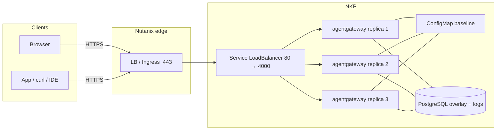

Most of what I've written about [agentgateway](https://agentgateway.dev)
assumes Kubernetes. That's still the right home for it in production.
<br>
This post is the Nutanix version of that sentence:
[Solo Enterprise for agentgateway](https://docs.solo.io/agentgateway/standalone/latest/)
in **standalone mode**, integrated onto infrastructure you already run —
**Nutanix Kubernetes Platform (NKP)** first, an AHV guest only if you want
a lab. One process per replica. One config file as the baseline. No
enterprise control plane. No custom resources. The same enterprise
features as Kubernetes mode, with HA coming from replicas plus a shared
PostgreSQL, not from a second product you have to invent.

<br>
I'm pinning **2026.9.0** / **v2026.9.0** — the latest-stream release that
[adds standalone mode](https://docs.solo.io/agentgateway/standalone/latest/release-notes/release-notes/).
Current LTS streams are Kubernetes-mode only. Stay on latest until the next
LTS (Solo has that around October).

<br>
The Nutanix layout below is **how I would integrate it**, not a Solo–Nutanix
joint guide. There isn't one. Image, chart, license, storage, and ports
come from Solo's public standalone docs. If a command disagrees with this
page later, believe
[docs.solo.io](https://docs.solo.io/agentgateway/standalone/latest/).

When the production path is up, clients hit one VIP and the cluster holds
more than one proxy:

| Address | Who uses it | Notes |
|---------|-------------|-------|
| `https://<vip>/ui` | You, in a browser | TLS on the Nutanix LB / Ingress; backend is gateway **4000** (Service maps **80 → 4000**) |
| `https://<vip>/...` | Apps, `curl`, IDEs | Same Service. Add routes and policies in Helm values or the UI overlay |
| `:15000` | Operators on a port-forward | Admin is loopback inside each pod. Not the front door |

## Before you start

You need:

- A **Solo Enterprise for agentgateway license key**. The proxy
  [refuses to start](https://docs.solo.io/agentgateway/standalone/latest/setup/license/)
  without a valid one. Placeholder everywhere below: `<license-key>`.
- **NKP** (or any Kubernetes NKP is wrapping) if you want the production
  path: `kubectl`, `helm`, and a StorageClass that can back PostgreSQL.
- A **PostgreSQL** you are willing to keep. Solo is explicit: more than one
  replica means PostgreSQL, not a shared SQLite file. Production means a
  **PersistentVolumeClaim or a managed instance**, not `emptyDir`.
- A place for the license that is **not git** — a Kubernetes Secret on NKP,
  or a `600` `.env` on an AHV lab VM.

The enterprise image and the standalone chart sit on a
[public registry](https://docs.solo.io/agentgateway/standalone/latest/setup/install/helm/).
No pull credentials unless you mirrored them.

## What standalone mode is

[Standalone mode](https://docs.solo.io/agentgateway/standalone/latest/about/introduction/)
is the agentgateway process plus one configuration file. You install it as
a
[binary](https://docs.solo.io/agentgateway/standalone/latest/setup/install/binary/),
a
[Docker container](https://docs.solo.io/agentgateway/standalone/latest/setup/install/docker/),
or a
[Helm Deployment](https://docs.solo.io/agentgateway/standalone/latest/setup/install/helm/)
that does **not** install a control plane. The chart is
`enterprise-agentgateway-standalone`. Pin **v2026.9.0**.

| | Standalone (this post) | Kubernetes mode |
|--|------------------------|-----------------|
| What runs | Proxy process (scale with `replicaCount`) | Control plane + proxies |
| Source of truth | Config file (Helm: ConfigMap) plus optional Postgres overlay | Enterprise CRs + Gateway API |
| License | **Each proxy** holds its own key | The control plane holds the key |
| HA on Nutanix | NKP replicas + shared PostgreSQL + an LB | Same cluster, different charts |

Same enterprise features either way. Different operational model. Don't
follow Kubernetes-mode pages for this install — those charts and CRs are
not what this process reads. Stay in the
[standalone docs](https://docs.solo.io/agentgateway/standalone/latest/).

## Two paths, one product

| Path | Use it when | HA? |
|------|-------------|-----|
| **NKP + standalone Helm + PostgreSQL** (recommended) | Production, or anything you will still care about after a node reboot | Yes — `replicaCount: 3` (or 2+), shared Postgres, LB in front |
| **AHV VM + Docker Compose** | A lab, a first look, a laptop-shaped box in Prism | **No.** One VM is one failure domain |
| **2–3 AHV VMs + VIP + shared Postgres** | You want HA and you do not have NKP yet | Yes, if every instance points at the **same** PostgreSQL and the VIP health-checks **4000** |

I run production on NKP. The VM is how I prove the image starts.

## The shape of production



Two rules that do not change between lab and prod:

1. **Clients use the gateway port, not 15000.** Generated Docker config
   attaches the UI to `default` on **4000**. The Helm Service maps
   **80 → 4000**. Admin stays on loopback inside the process. Publishing
   15000 is not the supported UI path —
   [Docker](https://docs.solo.io/agentgateway/standalone/latest/setup/install/docker/)
   and
   [Helm](https://docs.solo.io/agentgateway/standalone/latest/setup/install/helm/)
   both say so.
2. **The license is not optional.** A replica that cannot present
   `ENTERPRISE_AGENTGATEWAY_LICENSE_KEY` or `config.license.key.file`
   does not start.

## Recommended production path: NKP + standalone Helm + HA

This is Solo's
[standalone Helm chart](https://docs.solo.io/agentgateway/standalone/latest/setup/install/helm/)
on NKP: a Deployment, no control plane, same file the binary reads. HA is
**three replicas**, **one PostgreSQL**, and **one Service** that NKP (or
MetalLB, or a Nutanix load balancer, or Ingress) fronts.

Wrong chart — the Kubernetes-mode control-plane charts — and you installed
a different operational model. Stay on
`enterprise-agentgateway-standalone`.

### Why PostgreSQL is not optional at this replica count

[Solo's database page](https://docs.solo.io/agentgateway/standalone/latest/setup/database/)
picks the backend from the URL: `postgres://` / `postgresql://` is
PostgreSQL; everything else is a SQLite file.

SQLite is for **one** instance. Do **not** point more than one
agentgateway at the same SQLite file. If you do, you are sharing a file
the product told you not to share. Give each instance its own file
(Analytics then shows only that instance) or use PostgreSQL.

For multi-replica **and** a writable UI overlay **and** Analytics /
budgets, the chart's path is `mode: database`. That sets
`config.storage.mode: hybrid` and `config.database.url` from
`database.postgres.url`. Every pod reads the same ConfigMap baseline and
the same Postgres overlay. A UI save on one replica is visible on the
others —
[configuration storage](https://docs.solo.io/agentgateway/standalone/latest/setup/storage/).

Default chart `mode` is `readonly`. ConfigMap is mounted read-only. Save
in the UI fails. Analytics reports that no request-log database is
configured. Fine for a values-only lab. Not this production path.

Do **not** set `config.config.database` yourself while `mode` is
`database`. The chart derives it and overwrites you.

### Postgres that survives a reschedule

Solo's storage docs ship a single-instance Postgres example on
`emptyDir` for **testing**. They also say what that means: if the
Postgres pod restarts, the UI overlay and the logs are gone, and
agentgateway falls back to the ConfigMap baseline.

For production: **PersistentVolumeClaim or managed PostgreSQL**. Not
`emptyDir`. I am not going to invent an operator manifest here — use
whatever NKP already runs for stateful data, or a managed instance the
pods can route to. The URL you hand the chart must start with
`postgres://` or `postgresql://`.

### License Secret

Each replica holds its own key. Keep it out of Helm values and out of
the ConfigMap. Secret + `config.license.key.file` on the mount:

```sh
kubectl create namespace agentgateway-system
kubectl create secret generic agentgateway-license \
  -n agentgateway-system \
  --from-literal=license-key='<license-key>'
```

The chart has no dedicated license value.
`extraVolumes` / `extraVolumeMounts` (or `extraEnv`) are the hooks —
[Helm](https://docs.solo.io/agentgateway/standalone/latest/setup/install/helm/)
and
[Licensing](https://docs.solo.io/agentgateway/standalone/latest/setup/license/).

### Production-shaped values.yaml

Empty `llm` / `mcp` sections are intentional. In `hybrid` mode the file
is a read-only baseline; the UI cannot create a missing section, only
resources inside one that already exists. Solo documents that as
"sections must exist in the file."

```yaml
# values.yaml — production-shaped, placeholders only
replicaCount: 3
mode: database
database:
  postgres:
    url: postgres://<user>:<password>@<postgres-host>:5432/<database>
config:
  config:
    license:
      key:
        file: /etc/agentgateway/license/license-key
  gateways:
    default:
      port: 4000
  llm:
    providers: []
    models: []
    virtualModels: []
  mcp:
    targets: []
  ui:
    gateways: default
extraVolumes:
  - name: license
    secret:
      secretName: agentgateway-license
extraVolumeMounts:
  - name: license
    mountPath: /etc/agentgateway/license
    readOnly: true
```

Keep this whole file on every `helm upgrade`. Solo warns that a value you
leave out returns to its default — drop `mode: database` and the release
falls back to readonly.

### Install, pinned to v2026.9.0

```sh
helm upgrade -i enterprise-agentgateway-standalone \
  oci://us-docker.pkg.dev/solo-public/enterprise-agentgateway/charts/enterprise-agentgateway-standalone \
  --namespace agentgateway-system \
  --create-namespace \
  --version v2026.9.0 \
  -f values.yaml
```

Public OCI. Image pull needs no credentials unless `image.registry`
points at a mirror.

```sh
kubectl get pods -n agentgateway-system \
  -l app.kubernetes.io/name=enterprise-agentgateway-standalone
kubectl get svc -n agentgateway-system enterprise-agentgateway-standalone
```

You want three Ready pods and a Service of type **LoadBalancer**, port
**80 → 4000**. A pod in `CrashLoopBackOff` is usually the license check
or a Postgres URL the process cannot open. Logs first.

On NKP, put that Service behind whatever you already use for north-south
traffic: the Nutanix load balancer, MetalLB, or Ingress. Health-check the
**gateway** port (Service 80 / container 4000). Do not health-check
15000 from the network.

### What failover actually is


Virtual models are the **LLM-side** half of resilience: one client model name, several provider targets, and a **failover** policy so a dead upstream is not a dead request. Pair that with `replicaCount` + Postgres so the **gateway process** is also redundant.


I am going to be boring on purpose, because this is where integration
posts start inventing features.

What you have:

- **Three processes.** Kubernetes reschedules a dead pod. The Service
  endpoints drop an unready pod. The LB in front should stop sending it
  work once the health check fails.
- **One shared overlay.** In `database` mode every replica reads the same
  Postgres. A UI change is not trapped on the pod you happened to hit.
- **A rolling upgrade.** `helm upgrade` replaces pods. If you only have
  capacity for two of three during the roll, or if Postgres blips, expect
  a **brief disruption**. That is a Deployment, not a promise of
  zero-downtime sessions.

What Solo does **not** claim here, so I will not either: a special
active-active dataplane, shared in-memory session state across replicas,
or "the gateway never drops an in-flight MCP session if a pod dies."
Clients retry. Size `replicaCount` so a roll still leaves a Ready pod.
Keep Postgres on a disk that survives a reschedule.

Admin `:15000` stays inside the pod. For a license or storage check:

```sh
kubectl port-forward -n agentgateway-system \
  deploy/enterprise-agentgateway-standalone 15000:15000
curl -s localhost:15000/api/runtime | jq '{license, ui}'
```

You want `license.state` of `running` and `ui.configStoreMode` of
`hybrid`.

### TLS in front of the LB

The chart Service is HTTP **80 → 4000**. Terminate TLS on the Nutanix
load balancer or Ingress in front. Open **443/tcp** on that front door.
Leave pod 4000 reachable only from the LB subnet if you can.

Do not publish 15000 "for HTTPS." Wrong port, wrong interface. Before
`/ui` is on a network you do not trust, follow
[Secure the UI](https://docs.solo.io/agentgateway/standalone/latest/setup/ui/secure-ui/).

## Smoke test (production)


Placeholders only. `<lb>` is the VIP or Ingress hostname.

```sh
LB=https://<lb>

# 1. Three replicas, Service 80 → 4000
kubectl get pods,svc -n agentgateway-system \
  -l app.kubernetes.io/name=enterprise-agentgateway-standalone

# 2. License + hybrid storage (port-forward; admin is loopback)
kubectl port-forward -n agentgateway-system \
  deploy/enterprise-agentgateway-standalone 15000:15000
curl -s localhost:15000/api/runtime | jq '{license, ui}'
# license.state: running
# ui.configStoreMode: hybrid

# 3. UI on the gateway path, through the LB — not :15000 on the VIP
curl -sI "$LB/ui" | head -5

# 4. Admin is not the front door
curl -sS --connect-timeout 2 https://<lb>:15000/ui || true

# 5. A killed pod comes back; the Service still has endpoints
kubectl delete pod -n agentgateway-system \
  -l app.kubernetes.io/name=enterprise-agentgateway-standalone \
  --field-selector=status.phase=Running --wait=false
# delete one pod by name if you prefer a surgical check
kubectl get pods -n agentgateway-system \
  -l app.kubernetes.io/name=enterprise-agentgateway-standalone -w
```

If pods crash and logs mention the license, fix the Secret before you
debug MetalLB. If pods are Ready and `curl` to the VIP fails, it is the
LB or the VLAN, not agentgateway.

## Lab path: one AHV VM + Docker (not HA)

A single AHV guest maps 1:1 onto Solo's
[Docker standalone](https://docs.solo.io/agentgateway/standalone/latest/setup/install/docker/)
docs: mount `/config`, pass the license, publish **4000**. Useful. **Not
HA.** The VM dies, the gateway dies. Do not put production traffic here
and call the Nutanix cluster "the HA."

### VM and network

Ubuntu 22.04 / 24.04 or RHEL-like. Sizing is a **starting point**, not a
Solo worksheet: lab 2 vCPU / 4 GiB / 40 GiB; if you keep it around, 4 /
8 / 80 plus a vDisk for `/config`. VLAN your browser can reach. Allow
**4000/tcp**. Do not open **15000/tcp**.

```sh
curl -fsSL https://get.docker.com | sh
sudo usermod -aG docker "$USER"
# log out and back in
mkdir -p ~/enterprise-agentgateway/agentgateway-config
cd ~/enterprise-agentgateway
```

### License in `.env`

```sh
cat > .env <<'EOF'
ENTERPRISE_AGENTGATEWAY_LICENSE_KEY=<license-key>
EOF
chmod 600 .env
```

Do not commit it. Environment variable wins if you also set
`config.license.key.file`.

### Compose

`user:` must be your UID:GID (`id -u && id -g`). Image is public,
amd64 + arm64, tag **2026.9.0** (no leading `v` — that `v` is the
binary/Helm version).

```yaml
# compose.yaml
services:
  agentgateway:
    container_name: agentgateway
    restart: unless-stopped
    image: us-docker.pkg.dev/solo-public/enterprise-agentgateway/agentgateway-enterprise:2026.9.0
    user: "1000:1000"
    environment:
      ENTERPRISE_AGENTGATEWAY_LICENSE_KEY: ${ENTERPRISE_AGENTGATEWAY_LICENSE_KEY}
    ports:
      - "4000:4000"
    volumes:
      - ./agentgateway-config:/config
```

```sh
docker compose up -d
docker compose logs -f
```

Lines that mean it worked:

```
info	state_manager	loaded config from File("/config/config.yaml")
info	state_manager	Watching config file: /config/config.yaml
info	app	serving UI at http://localhost:4000/ui
info	proxy::gateway	started bind	bind="bind/4000"
```

Generated config includes SQLite for Analytics/Logs and attaches the UI
to `default`. A file you write yourself needs `config.database` added or
those pages stay empty.

```
http://<vm-ip>:4000/ui
```

Same UI rule as prod: private VLAN is fine; anything else wants
[Secure the UI](https://docs.solo.io/agentgateway/standalone/latest/setup/ui/secure-ui/).
Optional TLS is a reverse proxy or VIP in front of **4000**, not 15000.

Binary install on the same VM, if you do not want Docker:

```sh
export ENTERPRISE_AGENTGATEWAY_LICENSE_KEY=<license-key>
curl -fsSL https://run.solo.io/agentgateway/install | AGENTGATEWAY_VERSION=v2026.9.0 sh
export PATH="$HOME/.agentgateway/bin:$PATH"
agentgateway --version
```

Installs `agentgateway` and `agentgateway-sts` into
`$HOME/.agentgateway/bin`. PATH is manual.

### Lab smoke test

```sh
VM=http://<vm-ip>:4000
docker compose ps
docker compose logs --tail=50 | grep -E 'serving UI|started bind'
curl -sI "$VM/ui" | head -5
curl -sS --connect-timeout 2 http://<vm-ip>:15000/ui || true
ls -l ~/enterprise-agentgateway/agentgateway-config
```

## AHV HA without NKP: 2–3 VMs, one VIP, one Postgres

If NKP is not on the table yet and a single VM is not acceptable: run
the **same** standalone process on two or three AHV guests, put a
**Nutanix load balancer VIP** on **4000**, and point every instance at
**one shared PostgreSQL** in `hybrid` storage. That is the Docker/binary
equivalent of `mode: database` + `replicaCount: 3`.

Still not a Solo high-availability appliance. Same honesty as NKP: the
VIP removes a dead backend; in-flight work on that VM is gone; Postgres
must outlive any one guest.

Do **not** put `sqlite:///config/data.db` on a shared NFS and mount it
on three VMs. Solo: do not share one SQLite file across instances.

Sketch — Compose on each VM, secrets in `.env` only:

```yaml
# config.yaml on every VM (hybrid + shared Postgres)
# yaml-language-server: $schema=https://agentgateway.dev/schema/config
config:
  storage:
    mode: hybrid
  database:
    url: postgres://<user>:<password>@<postgres-host>:5432/<database>
  license:
    key:
      file: /license/license.key
gateways:
  default:
    port: 4000
ui:
  gateways: default
llm:
  providers: []
  models: []
  virtualModels: []
mcp:
  targets: []
```

```yaml
# compose.yaml — each VM
services:
  agentgateway:
    image: us-docker.pkg.dev/solo-public/enterprise-agentgateway/agentgateway-enterprise:2026.9.0
    user: "1000:1000"
    environment:
      ENTERPRISE_AGENTGATEWAY_LICENSE_KEY: ${ENTERPRISE_AGENTGATEWAY_LICENSE_KEY}
    ports:
      - "4000:4000"
    volumes:
      - ./config.yaml:/config.yaml
      - ./license.key:/license/license.key:ro
    command: ["-f", "/config.yaml"]
```

VIP health-checks `4000/tcp` on each guest. TLS still belongs on the
VIP, not on 15000. Postgres on a volume or a managed instance — the same
`emptyDir` warning applies if you hid Postgres in a container with no
disk.

## What's reachable

| Address | Production (NKP) | Lab (one AHV VM) |
|---------|------------------|------------------|
| Gateway UI | `https://<vip>/ui` (LB 80 → 4000) | `http://<vm-ip>:4000/ui` |
| Gateway traffic | Same VIP | Same `:4000` |
| `:15000` on the VIP / VM IP | No | No |
| Port-forward `15000:15000` | Debug / `api/runtime` only | Same, on the VM loopback |

## Eight mistakes that will cost you an afternoon

1. **No license, or the key only in git.** The process exits. Secret or
   `.env`, then
   [Licensing](https://docs.solo.io/agentgateway/standalone/latest/setup/license/).
2. **One SQLite file, three replicas.** Solo tells you not to. Analytics
   lies or the file contends. `replicaCount > 1` means PostgreSQL.
3. **`emptyDir` for production Postgres.** A reschedule wipes the UI
   overlay and the logs. PVC or managed Postgres.
4. **`mode: database` with `replicaCount` left at 1**, or the reverse:
   three replicas still on `readonly` + SQLite. HA needs **both** the
   replica count **and** shared Postgres. A `helm upgrade` that omits
   `mode: database` snaps back to readonly.
5. **Publishing 15000 and wondering where the UI went.** Gateway port.
   `4000` on Docker, `80 → 4000` on the chart Service.
6. **Calling a single AHV VM "HA"** because the Nutanix cluster has
   other nodes. The guest is still one process on one disk.
7. **Following Kubernetes-mode docs.** Control plane, CRs, a different
   license holder. This post is
   [standalone](https://docs.solo.io/agentgateway/standalone/latest/).
8. **Pinning LTS and wondering why standalone is missing.** Latest
   stream, starting **2026.9.0**, until the next LTS (around October).

## What this is, and isn't

What you get on NKP: the enterprise proxy as a standalone Deployment,
three replicas, a ConfigMap baseline, a Postgres overlay, a Service on
80→4000, and whatever TLS you put in front. License check at start. Same
features as Kubernetes mode, without that control plane.

What you do **not** get: a Solo-documented zero-downtime mesh, Prism
packaging, or a joint reference architecture. Kubernetes reschedules.
The LB drops bad backends. Rolling upgrades can blip. That is the whole
failover story, and it is enough if Postgres and `replicaCount` are
honest.

Rotate anything that landed in a ticket. Don't commit `.env` or a
values file with a real `postgres://` password. Don't leave
unauthenticated `/ui` on a network you do not trust.

## The takeaway

The integration is thin on purpose. Solo already documented standalone
mode, the public Helm chart, `mode: database`, and "do not share
SQLite." Nutanix is where those replicas land: NKP for the Deployment,
a load balancer you already know, and a Postgres that survives a
reschedule.

Pin `v2026.9.0`, set `replicaCount: 3`, give every pod the same
PostgreSQL URL, publish the gateway port, keep the license in a Secret.
That is the production path. The AHV VM is how you learn the UI in an
afternoon. Do not confuse the two.

---

*Standalone docs home:
[docs.solo.io/agentgateway/standalone/latest](https://docs.solo.io/agentgateway/standalone/latest/).
Helm chart, Service 80→4000, license Secret:
[setup/install/helm](https://docs.solo.io/agentgateway/standalone/latest/setup/install/helm/).
`readonly` vs `database` / hybrid overlay, `replicaCount`, emptyDir
warning:
[setup/storage](https://docs.solo.io/agentgateway/standalone/latest/setup/storage/).
SQLite vs PostgreSQL, "do not share one SQLite file":
[setup/database](https://docs.solo.io/agentgateway/standalone/latest/setup/database/).
License env and `config.license.key.file`:
[setup/license](https://docs.solo.io/agentgateway/standalone/latest/setup/license/).
Docker lab (UI on 4000, admin loopback):
[setup/install/docker](https://docs.solo.io/agentgateway/standalone/latest/setup/install/docker/).
Release stream:
[release notes](https://docs.solo.io/agentgateway/standalone/latest/release-notes/release-notes/).
Nutanix NKP / AHV / LB layout in this post is operational advice, not a
joint reference architecture.*
