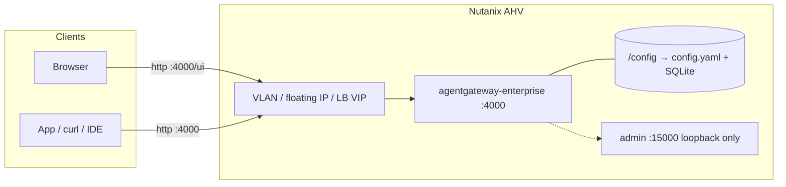

Most of what I've written about [agentgateway](https://agentgateway.dev)
assumes Kubernetes. That's still the right home when you want GitOps, Gateway
API objects, and a control plane that licenses a fleet of proxies.
<br>
This post is the other shape: **one Nutanix AHV virtual machine**, Docker
Engine plus Compose, and
[Solo Enterprise for agentgateway](https://docs.solo.io/agentgateway/standalone/latest/)
in **standalone mode**. One process. One config file. No control plane. No
custom resources. The same enterprise features as Kubernetes mode, on a VM
your Prism operators already know how to size, VLAN, and back up.

<br>
I'm pinning **2026.9.0** — that's the latest-stream release that
[adds standalone mode](https://docs.solo.io/agentgateway/standalone/latest/release-notes/release-notes/).
Current LTS streams are Kubernetes-mode only. Stay on latest until the next
LTS (Solo has that around October).

<br>
The Nutanix bits below are **my recommendations**, not a Solo–Nutanix joint
guide. The proxy install, image, ports, and license rules are from Solo's
public standalone docs. If a command disagrees with this page later, believe
[docs.solo.io](https://docs.solo.io/agentgateway/standalone/latest/).

When you're done, one AHV VM serves the enterprise UI on the gateway port:

| Address | Who uses it | Notes |
|---------|-------------|-------|
| `http://<vm-ip>:4000/ui` | You, in a browser | Generated config attaches the UI to the `default` gateway |
| `http://<vm-ip>:4000/...` | Apps, `curl`, IDEs | Same gateway; add routes and policies in the UI or the file |
| `:15000` on the VM | Nobody from the network | Admin is container loopback. Publishing it does not expose the UI |

## Before you start

You need four things:

- A **Solo Enterprise for agentgateway license key**. The proxy
  [refuses to start](https://docs.solo.io/agentgateway/standalone/latest/setup/license/)
  without a valid one. If you don't have a key, talk to your Solo account
  team. This how-to uses the placeholder `<license-key>` everywhere.
- **Prism** access to create an AHV VM on a VLAN your clients can reach (or
  that a load-balancer VIP can reach).
- An **Ubuntu 22.04 / 24.04** or RHEL-like guest. I use Ubuntu below because
  Docker Engine's install is boring there. The Compose file is the same on
  either.
- A place to keep the license that is **not git**. A `.env` file on the VM,
  mode `600`, owned by the user who runs Compose.

You do **not** need NKP, Helm, or a private image pull secret. The enterprise
image lives on a
[public registry](https://docs.solo.io/agentgateway/standalone/latest/setup/install/docker/).

## What standalone mode is

[Standalone mode](https://docs.solo.io/agentgateway/standalone/latest/about/introduction/)
is a single agentgateway process that reads one configuration file. You
install it as a
[binary](https://docs.solo.io/agentgateway/standalone/latest/setup/install/binary/),
a
[Docker container](https://docs.solo.io/agentgateway/standalone/latest/setup/install/docker/),
or a
[Helm Deployment](https://docs.solo.io/agentgateway/standalone/latest/setup/install/)
that does **not** install a control plane.

| | Standalone (this post) | Kubernetes mode |
|--|------------------------|-----------------|
| What runs | One proxy process | Control plane + proxies |
| Source of truth | A config file you mount or generate | Enterprise CRs + Gateway API |
| License | **Each proxy** holds its own key (`ENTERPRISE_AGENTGATEWAY_LICENSE_KEY` or `config.license.key.file`) | The control plane holds the key and licenses the proxies it manages |
| Where it fits on Nutanix | AHV VM with Docker, or an NKP Deployment with the standalone chart | NKP (or any cluster) when you want GitOps and CRs |

Same enterprise features and support either way. Different operational
model. Don't follow Kubernetes-mode pages for this VM — they talk about
charts and CRs this process will never see. Stay in the
[standalone docs](https://docs.solo.io/agentgateway/standalone/latest/).

## Why an AHV VM, not NKP, for the first box

Solo's Docker standalone path is "mount `/config`, pass the license, publish
**4000**." That maps 1:1 onto an AHV guest. Prism gives you the VM, the NIC,
the VLAN, and a disk that survives a reboot. Compose gives you the restart
policy. You are not translating Helm values into NKP storage classes just to
open a UI.

Pick **NKP + standalone Helm** instead when the VM would be a pet you don't
want: you already operate the cluster, you want a Service/Ingress in front,
and you're fine managing the file through Helm values. Pick **Kubernetes
mode** (not this post) when you want the control plane, Gateway API, and
CRs — that's a different install and a different license path.

I still start on the VM. You can move the same `config.yaml` later.

## The shape of it



Two rules to keep in your head:

1. **Publish 4000, not 15000.** The generated config attaches the UI to the
   `default` gateway. The admin interface stays on the container's own
   loopback. Mapping host `15000:15000` does not make `/ui` reachable, and
   it is not the supported path. Solo is explicit about this in the
   [Docker install](https://docs.solo.io/agentgateway/standalone/latest/setup/install/docker/).
2. **The license is not optional.** Open source agentgateway starts with no
   key. This image does not. A container that exits immediately almost
   always failed the license check.

## Step 1: create the AHV VM

In **Prism Element** (or Prism Central): create a VM on the cluster and
subnet you actually want clients on.

Guest OS I use:

- **Ubuntu 22.04 or 24.04** — copy-paste Docker install below.
- **RHEL-like** — same Compose file; install Docker Engine from Docker's
  RHEL instructions instead of `get.docker.com`.

Sizing is **a starting point**, not a Solo sizing guide and not a Nutanix
best-practice worksheet. Bump it when the UI, SQLite, and your real traffic
ask for it.

| Role | vCPU | RAM | Disk | Notes |
|------|------|-----|------|-------|
| Lab / first look | 2 | 4 GiB | 40 GiB OS | Enough to pull the image, generate config, and click around |
| Light production | 4 | 8 GiB | 80 GiB OS + a separate volume for `/config` | Give `/config` its own vDisk so you can snapshot it independently |

Connect a NIC on the **VLAN/subnet** clients (or the load balancer) will
use. Attach Nutanix Guest Tools if that's how you do IP and disk ops in
this cluster. Power on, SSH in as a user who can `sudo`.

## Step 2: networking you actually need

Standalone agentgateway is one listening socket on **4000/tcp** for the
generated config. Plan the path to that port before you install Docker.

| Piece | What I do on Nutanix |
|-------|----------------------|
| VLAN / subnet | Put the VM on a subnet your operators and apps can route to. Don't hide the first lab behind a jump host unless you have to — you'll spend the afternoon debugging "UI won't load" that is just routing. |
| How clients find it | A stable VM IP is enough for a lab. For anything shared, put a **floating IP** or a **load-balancer VIP** in front and point people at the VIP. |
| Firewall / security policy | Allow **4000/tcp** from the clients that should reach the gateway. If you terminate TLS on a reverse proxy or Nutanix load balancer in front, also allow **443/tcp** to *that* front door — the VM can stay on 4000 on the inside. |
| What not to open | **15000/tcp** from the network. You don't need it, and publishing it from Docker still doesn't put the authenticatable UI there. |

Write down the address you'll hand people. That's `<vm-ip>` in every curl
below — the guest IP, or the VIP if you put one in front.

## Step 3: install Docker Engine and Compose

On Ubuntu, the fastest path that matches Solo's Docker docs is Docker's
convenience script, then your user in the `docker` group:

```sh
curl -fsSL https://get.docker.com | sh
sudo usermod -aG docker "$USER"
# log out and back in so the group sticks
docker version
docker compose version
```

Confirm `docker compose` (plugin) works. The rest of this post uses
`docker compose`, not the old `docker-compose` binary.

Create a directory that will hold the Compose file, the env file, and the
persistent config mount:

```sh
mkdir -p ~/enterprise-agentgateway/agentgateway-config
cd ~/enterprise-agentgateway
```

That `agentgateway-config` directory is the disk. Treat it like one.

## Step 4: license in `.env`, never in git

Export is fine for a five-minute trial. On a VM you will reboot, put the
key in a `.env` file next to Compose. Compose reads
`${ENTERPRISE_AGENTGATEWAY_LICENSE_KEY}` from the shell or from that file —
that's how
[Solo's Compose example](https://docs.solo.io/agentgateway/standalone/latest/setup/install/docker/)
is written.

```sh
cd ~/enterprise-agentgateway
cat > .env <<'EOF'
ENTERPRISE_AGENTGATEWAY_LICENSE_KEY=<license-key>
EOF
chmod 600 .env
```

Replace `<license-key>` with the real key. Do not commit `.env`. Do not
paste the key into `compose.yaml`. Do not put it in a Prism note that gets
screenshotted.

The other official option is a file the config points at with
`config.license.key.file`. Environment variable wins if both are set. For
this VM I stay on the env var so the generated `config.yaml` can stay
exactly what the image writes.

## Step 5: Compose file with a writable `/config`

This is Solo's Compose shape, pointed at a persistent directory on the VM.
The `user` line must be **your** UID and GID so the container can write the
generated config and the SQLite file. `1000:1000` is the usual first Ubuntu
user; check with `id -u && id -g` and replace if yours differ.

```yaml
# compose.yaml
services:
  agentgateway:
    container_name: agentgateway
    restart: unless-stopped
    image: us-docker.pkg.dev/solo-public/enterprise-agentgateway/agentgateway-enterprise:2026.9.0
    # Replace with your user and group IDs: id -u && id -g
    user: "1000:1000"
    environment:
      ENTERPRISE_AGENTGATEWAY_LICENSE_KEY: ${ENTERPRISE_AGENTGATEWAY_LICENSE_KEY}
    ports:
      - "4000:4000"
    volumes:
      - ./agentgateway-config:/config
```

That image is
`us-docker.pkg.dev/solo-public/enterprise-agentgateway/agentgateway-enterprise:2026.9.0`
— public, **amd64 and arm64**, no pull credentials. Do not substitute the
open-source `cr.agentgateway.dev/agentgateway` image. That binary has no
enterprise license check and is not this product.

`--user` / `user:` is not cosmetic. Without it, a root-owned file in
`/config` and a later run as your UID will fail writes, and the UI won't
persist changes.

Start it:

```sh
cd ~/enterprise-agentgateway
docker compose up -d
docker compose ps
docker compose logs -f
```

A healthy first boot looks like Solo's documented log lines:

```
info	state_manager	loaded config from File("/config/config.yaml")
info	state_manager	Watching config file: /config/config.yaml
info	app	serving UI at http://localhost:4000/ui
info	proxy::gateway	started bind	bind="bind/4000"
```

If the container is gone when you `ps`, it failed the license check. Read
the logs, then
[Licensing](https://docs.solo.io/agentgateway/standalone/latest/setup/license/).

On first start the image generates `/config/config.yaml` and a SQLite
database beside it. The generated file looks like this (from
[Solo's Docker page](https://docs.solo.io/agentgateway/standalone/latest/setup/install/docker/)):

```yaml
# yaml-language-server: $schema=https://agentgateway.dev/schema/config
config:
  database:
    url: sqlite:///config/data.db
gateways:
  default:
    port: 4000
ui:
  gateways: default
```

That `config.database` block is why **Analytics** and **Logs** work. If you
later replace this file with one you wrote by hand, add `config.database`
yourself or those pages stay empty. Agentgateway does not backfill a
database into a file you supplied.

```sh
cat ~/enterprise-agentgateway/agentgateway-config/config.yaml
```

Keep that directory. Snapshot the vDisk. That's your models, keys, MCP
targets, and logs.

## Step 6: open the UI

From a browser that can reach the VM (or the VIP):

```
http://<vm-ip>:4000/ui
```

`<vm-ip>` is the guest address or the floating IP, not `localhost`, unless
you are SSH-tunneled. The log line says `localhost` because that's the
address *inside* the container.

The generated config serves the UI on the gateway **without** an
authentication policy. Fine on a private VLAN you trust. Not fine on a
path you don't control. Before this URL is anything more than a lab,
follow Solo's
[Secure the UI](https://docs.solo.io/agentgateway/standalone/latest/setup/ui/secure-ui/)
guide (OIDC on the gateway that serves `/ui`; `ui.policies` is how you
attach it). A gateway listener is as reachable as the rest of your proxy
traffic.

## Step 7: optional TLS in front

The container speaks HTTP on 4000. For HTTPS you put something in front —
that's the usual Nutanix pattern anyway:

- A **Nutanix load balancer** or **floating IP / VIP** that forwards 443 to
  the VM's 4000.
- NKP **Ingress** if you later move this to the cluster.
- A small **reverse proxy** (Caddy, nginx) on the same VM or a neighbor,
  terminating TLS and proxying to `127.0.0.1:4000` or the guest IP.

Open **443/tcp** on that front door. Leave the VM's 4000 limited to the
front door's subnet if you can. Don't try to publish `:15000` "for HTTPS" —
wrong port, wrong interface.

## Step 8: smoke test

Placeholders only. This is the whole check.

```sh
VM=http://<vm-ip>:4000

# 1. Container is up and bound to 4000
docker compose ps
# look for 0.0.0.0:4000->4000/tcp

# 2. Logs name the UI on the gateway, not only admin
docker compose logs --tail=50 | grep -E 'serving UI|started bind|license'
# serving UI at http://localhost:4000/ui
# started bind bind="bind/4000"

# 3. UI answers on the gateway port
curl -sI "$VM/ui" | head -5
# expect an HTTP response from the gateway, not a connection refused

# 4. Publishing 15000 is not the UI path — don't use this as your check
curl -sS --connect-timeout 2 http://<vm-ip>:15000/ui || true
# should fail from another host; admin is container loopback

# 5. Config and SQLite landed on the persistent mount
ls -l ~/enterprise-agentgateway/agentgateway-config
# config.yaml and a SQLite file (data.db) should be here after first boot
```

If `compose ps` is empty, the UI times out, and logs mention the license,
fix the key before you debug VLANs. If logs are healthy and `curl` to
`:4000/ui` fails, it's Prism networking or the hypervisor firewall, not
agentgateway.

## Optional: same VM, binary instead of Docker

If you'd rather not run a container, Solo's
[binary install](https://docs.solo.io/agentgateway/standalone/latest/setup/install/binary/)
is the same product. Linux **amd64** and **arm64** (macOS arm64 too; an
Intel Mac or Windows box should use the container).

```sh
export ENTERPRISE_AGENTGATEWAY_LICENSE_KEY=<license-key>
curl -fsSL https://run.solo.io/agentgateway/install | AGENTGATEWAY_VERSION=v2026.9.0 sh
export PATH="$HOME/.agentgateway/bin:$PATH"
agentgateway --version
```

The script installs `agentgateway` and `agentgateway-sts` into
`$HOME/.agentgateway/bin`. It does **not** update your `PATH` — you do.
Pin with `AGENTGATEWAY_VERSION=v2026.9.0` (the tag starts with `v`; the
container tag does not). Then `agentgateway` with no `-f` generates a
config under `~/.config/agentgateway` (or `$XDG_CONFIG_HOME/agentgateway`)
and serves the UI at `http://<vm-ip>:4000/ui` the same way.

I still prefer Compose on AHV: restart policy, one image pin, and `/config`
on a vDisk you can snapshot without hunting a home directory.

## Optional: NKP, when the VM is the wrong home

If this gateway has to live next to workloads already on
**Nutanix Kubernetes Platform**, use Solo's **standalone Helm** path: a
Deployment, no enterprise control plane, same config-file model. Follow
[Solo's install page](https://docs.solo.io/agentgateway/standalone/latest/setup/install/)
and the Helm tab there for the current chart and values — don't copy a
Kubernetes-mode chart and expect standalone behavior.

Use that when:

- You want a Kubernetes Service / Ingress (and NKP's load balancer) instead
  of a guest firewall hole.
- You're fine with Helm-owned config (the standalone chart mounts a
  ConfigMap; writable UI needs the storage/database setup Solo documents).

Use **Kubernetes mode** instead of standalone Helm when you want CRs, the
control plane, and Gateway API. Different docs:
[Kubernetes section](https://docs.solo.io/agentgateway/kubernetes/).
Different license holder (the control plane, not each proxy).

## What's reachable, in one table

| Address | From another host on the VLAN? |
|---------|--------------------------------|
| `http://<vm-ip>:4000/ui` | Yes, with the generated config |
| `http://<vm-ip>:4000/` (gateway traffic) | Yes, once you add routes |
| `https://<vip>/...` | Yes, if you put TLS in front |
| `:15000` on the VM IP | No. Loopback inside the container |
| Host-published `15000:15000` | Still not the supported UI. Use 4000 |

## Eight mistakes that will cost you an afternoon

1. **No license, or the wrong env name.** The process exits. Logs, then
   [Licensing](https://docs.solo.io/agentgateway/standalone/latest/setup/license/).
   The variable is `ENTERPRISE_AGENTGATEWAY_LICENSE_KEY`. A key in
   `compose.yaml` or a Prism screenshot will haunt you; keep it in `.env`.
2. **Publishing 15000 and wondering where the UI went.** Admin is
   `localhost:15000` *inside* the container. The UI you can authenticate
   later lives on the gateway. Publish **4000**. Open
   `http://<vm-ip>:4000/ui`.
3. **Pulling the open-source image.**
   `cr.agentgateway.dev/agentgateway` is not Solo Enterprise for
   agentgateway. Use
   `us-docker.pkg.dev/solo-public/enterprise-agentgateway/agentgateway-enterprise:2026.9.0`.
4. **No persistent disk for `/config`.** A container without that mount
   regenerates (or loses) `config.yaml` and the SQLite file on the next
   recreate. Models, virtual keys, and Analytics history vanish. Mount the
   directory. Snapshot the vDisk.
5. **Running the container as root against a directory you'll later mount
   as yourself.** Solo's Docker page uses
   `--user "$(id -u):$(id -g)"` for a reason. Match `user:` in Compose to
   `id -u` / `id -g`.
6. **Hand-writing `config.yaml` and expecting Analytics/Logs anyway.**
   Generated configs include `config.database`. Yours need that field added.
   See Solo's Docker page and the database docs it links.
7. **Following Kubernetes-mode docs on this VM.** Those pages assume a
   control plane and CRs. You don't have either. Stay in
   [standalone](https://docs.solo.io/agentgateway/standalone/latest/).
8. **Pinning an LTS stream and wondering why standalone isn't there.**
   Standalone is on **latest**, starting **2026.9.0**. Current LTS is
   Kubernetes-mode only until the next LTS (around October).

## What this is, and isn't

What you get is the enterprise proxy as one container, a generated config
with SQLite, and a UI on port 4000. License check at start. Same features
as Kubernetes mode, without the control plane.

What you do **not** get out of this Compose file: TLS, UI login, a
multi-node HA pair, or Prism-native "Solo on Nutanix" packaging. Those are
the next doors — reverse proxy / VIP for TLS,
[Secure the UI](https://docs.solo.io/agentgateway/standalone/latest/setup/ui/secure-ui/)
for OIDC, NKP + Helm or Kubernetes mode when the VM is too small a box.

Rotate the license material if it ever landed in a ticket or a screenshot.
Don't commit `.env`. Don't leave an unauthenticated `/ui` on a network you
don't trust.

## The takeaway

The interesting part isn't Nutanix, and it isn't Docker. It's how little
translation standalone mode needs. Solo already documented "one process,
one file, license in the environment, UI on the gateway port." An AHV VM
is just a place to put that file where the disk, the VLAN, and the
snapshot already exist.

Pin `2026.9.0`, publish **4000**, mount `/config`, keep the key out of git.
That's enough to open `http://<vm-ip>:4000/ui` and start putting LLM and
MCP traffic on a proxy you actually operate. When you outgrow the guest,
the same config idea moves to NKP — standalone Helm if you still want the
file, Kubernetes mode if you want CRs. Until then, this is the fastest
path I know to run Solo Enterprise for agentgateway on the cluster you
already have.

---

*Standalone docs home:
[docs.solo.io/agentgateway/standalone/latest](https://docs.solo.io/agentgateway/standalone/latest/).
Install methods (binary, Docker, Helm):
[setup/install](https://docs.solo.io/agentgateway/standalone/latest/setup/install/).
Docker and Compose, including why 15000 is the wrong port:
[setup/install/docker](https://docs.solo.io/agentgateway/standalone/latest/setup/install/docker/).
License env and `config.license.key.file`:
[setup/license](https://docs.solo.io/agentgateway/standalone/latest/setup/license/).
Standalone vs Kubernetes, and why LTS is still Kubernetes-mode only:
[introduction](https://docs.solo.io/agentgateway/standalone/latest/about/introduction/)
and
[release notes](https://docs.solo.io/agentgateway/standalone/latest/release-notes/release-notes/).
Nutanix AHV / NKP layout in this post is operational advice, not a joint
reference architecture.*
