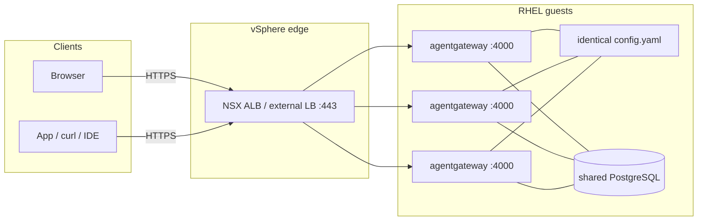

Most of what I've written about [agentgateway](https://agentgateway.dev)
assumes Kubernetes. This post is the VMware version of that sentence —
RHEL guests on vSphere, no Tanzu, no Helm.

What we're building is
[Solo Enterprise for agentgateway](https://docs.solo.io/agentgateway/standalone/latest/)
in **standalone mode**, running on infrastructure you already own:
**RHEL VMs on vSphere**, one process per guest, and a load balancer you
already know how to run.

- One process per replica
- One config file as the baseline
- No enterprise control plane
- No custom resources

You get the same enterprise features as Kubernetes mode — high
availability just comes from running several binaries against a shared
PostgreSQL, rather than from a second product you have to invent.

I'm pinning **2026.9.0** / **v2026.9.0**, the latest-stream release that
[adds standalone mode](https://docs.solo.io/agentgateway/standalone/latest/release-notes/release-notes/).
The current LTS streams are Kubernetes-mode only, so stay on latest until
the next LTS lands — Solo expects that around October.

One thing to be clear about up front: the vSphere layout below is **how I
would integrate it**, not a joint Solo–VMware guide. No such guide
exists. The binary, image, license, storage, and ports all come from
Solo's public standalone docs, and if a command here ever disagrees with
that page, believe
[docs.solo.io](https://docs.solo.io/agentgateway/standalone/latest/).

Once the production path is up, clients hit a single VIP and three RHEL
proxies sit behind it:

| Address | Who uses it | Notes |
|---------|-------------|-------|
| `https://<vip>/ui` | You, in a browser | TLS on the NSX ALB / external LB; the backend is gateway **4000** |
| `https://<vip>/...` | Apps, `curl`, IDEs | The same VIP. Add routes and policies in `config.yaml` or the UI overlay |
| `:15000` | Operators on that guest's loopback | Admin is loopback inside each process. It is not the front door |

## Before you start

Here's what you'll need:

- A **Solo Enterprise for agentgateway license key**. The proxy
  [refuses to start](https://docs.solo.io/agentgateway/standalone/latest/setup/license/)
  without a valid one, so sort this out first. The placeholder everywhere
  below is `<license-key>`.
- **Four RHEL guests on vSphere** — three proxy VMs plus one dedicated
  PostgreSQL VM (or a managed Postgres you already run). No Kubernetes,
  no Tanzu, no Helm.
- An **NSX Advanced Load Balancer VIP**, or any external L4/L7 load
  balancer that can health-check **4000** and terminate TLS.
- Firewall rules that let the LB reach each proxy on **4000/tcp**, and
  each proxy reach Postgres on **5432/tcp**. Don't open **15000/tcp**.
- Somewhere to keep the license that **isn't git** — a `600`-mode file
  under `/etc/agentgateway`, or a systemd `EnvironmentFile` with the
  same permissions.

The
[enterprise binary](https://docs.solo.io/agentgateway/standalone/latest/setup/install/binary/)
and the
[public image](https://docs.solo.io/agentgateway/standalone/latest/setup/install/docker/)
need no pull credentials unless you've mirrored them.

## What standalone mode is

[Standalone mode](https://docs.solo.io/agentgateway/standalone/latest/about/introduction/)
is the agentgateway process plus a single configuration file. You can
install it as a
[binary](https://docs.solo.io/agentgateway/standalone/latest/setup/install/binary/),
a
[Docker container](https://docs.solo.io/agentgateway/standalone/latest/setup/install/docker/),
or a
[Helm Deployment](https://docs.solo.io/agentgateway/standalone/latest/setup/install/helm/)
— and none of those install a control plane. This post is the **binary
plus systemd** path, pinned to **v2026.9.0**. Docker is a footnote.
Helm stays on the shelf; there is no cluster here.

| | Standalone (this post) | Kubernetes mode |
|--|------------------------|-----------------|
| What runs | The proxy process (scale it with more VMs) | Control plane + proxies |
| Source of truth | A config file plus an optional Postgres overlay | Enterprise CRs + Gateway API |
| License | **Each proxy** holds its own key | The control plane holds the key |
| HA on vSphere | Three RHEL binaries + shared PostgreSQL + an LB | A cluster, different charts |

You get the same enterprise features either way; what differs is the
operational model. Don't follow Kubernetes-mode pages for this install —
those charts and CRs aren't what this process reads. Stay in the
[standalone docs](https://docs.solo.io/agentgateway/standalone/latest/).

## The shape of production




Three RHEL proxy VMs, one shared `config.yaml` baseline, one PostgreSQL.
The VIP is the only address clients should know. TLS terminates at the
edge.

Two rules hold whether you're in a lab or in production:

1. **Clients use the gateway port, not 15000.** The generated binary
   config attaches the UI to `default` on **4000**. Admin stays on
   loopback inside the process. Publishing 15000 isn't the supported UI
   path — the
   [binary](https://docs.solo.io/agentgateway/standalone/latest/setup/install/binary/)
   and
   [Docker](https://docs.solo.io/agentgateway/standalone/latest/setup/install/docker/)
   docs say so.
2. **The license is not optional.** A replica that can't present
   `ENTERPRISE_AGENTGATEWAY_LICENSE_KEY` or `config.license.key.file`
   will not start.

## Configure the RHEL VMs (vSphere)

Create **four** guests, attach them to the same port group / VLAN your
LB and operators can reach, and install RHEL 9. I'm not going to invent
a vCenter click-path; if you can create a VM, attach a NIC, and get to
a root shell, that's the whole hypervisor step.

Treat the sizing as a **starting point**, not a Solo worksheet:

| Role | Guests | Starting point |
|------|--------|----------------|
| Proxy | 3 | 2–4 vCPU, 4–8 GiB RAM, 40 GiB disk |
| PostgreSQL | 1 | 2–4 vCPU, 8 GiB RAM, disk that will hold the overlay and the logs |

Name them something you'll still recognize in six months —
`agw-proxy-1`, `agw-proxy-2`, `agw-proxy-3`, `agw-postgres`. Put
Postgres on a vDisk you actually back up. The proxies are cattle; the
database is not.

On every guest, time has to agree. RHEL 9 ships `chronyd`:

```sh
# every VM
systemctl enable --now chronyd
timedatectl
```

On each **proxy** VM, create a system user and the directories the unit
will use:

```sh
# each proxy VM
useradd --system --home-dir /var/lib/agentgateway \
  --create-home --shell /sbin/nologin agentgateway
install -d -m 0750 -o agentgateway -g agentgateway \
  /etc/agentgateway /var/lib/agentgateway
```

Open **4000/tcp** for the load balancer. If you can scope that to the
LB addresses instead of the whole VLAN, do that:

```sh
# each proxy VM — prefer a rich rule scoped to the LB
firewall-cmd --permanent --add-port=4000/tcp
firewall-cmd --reload
```

Don't open **15000**. Admin is loopback on purpose.

RHEL 9 defaults to SELinux enforcing. A binary in `/usr/local/bin`
listening on 4000 is an ordinary unprivileged bind; you usually don't
need a custom policy. If `systemctl start` dies with an AVC and
`ausearch -m avc -ts recent` points at the unit, fix that denial — don't
set `SELINUX=permissive` and call it done.

On the **Postgres** VM, allow **5432/tcp** from the three proxy
addresses only. Same idea: a rich rule beats `add-port` to the world.

## Install PostgreSQL for HA

[Solo's database page](https://docs.solo.io/agentgateway/standalone/latest/setup/database/)
picks the backend from the URL: `postgres://` or `postgresql://` gets you
PostgreSQL, and anything else is treated as a SQLite file.

SQLite is meant for **one** instance. Do **not** point more than one
agentgateway at the same SQLite file — if you do, you're sharing a file
the product explicitly told you not to share. NFS does not make that
legal. Give each instance its own file (Analytics will then show only
that instance), or move to PostgreSQL.

At three proxies you also want a writable UI overlay **and** Analytics
or budgets that aren't trapped on whichever guest you happened to hit.
That is
[`config.storage.mode: hybrid`](https://docs.solo.io/agentgateway/standalone/latest/setup/storage/)
plus a shared `config.database.url`. Hybrid keeps `config.yaml` as a
read-only baseline and stores UI edits in the database. Without a
database URL, hybrid refuses to start:
`config.storage.mode=hybrid requires config.database.url`.

That's why Postgres is required at replica count > 1. Three processes
and one SQLite file is not HA. Three processes and three SQLite files
is three labs.

I'm installing PostgreSQL on its own RHEL guest. A managed instance
with the same URL shape is fine; I'm not going to invent an operator
manifest. Schema is created on the **first agentgateway start**, not
when you create the empty database — Solo documents the tables
(`request_logs`, `request_log_payloads`, `budget_usage`,
`agw_config_resources`) appearing after the proxy has connected.

```sh
# on the Postgres VM — RHEL 9 AppStream
dnf install -y postgresql-server postgresql
postgresql-setup --initdb
systemctl enable --now postgresql
```

Listen on the data NIC, not only localhost. A Postgres that only binds
`127.0.0.1` is the afternoon you'll spend staring at `connection
refused` from three otherwise healthy proxies.

```sh
# /var/lib/pgsql/data/postgresql.conf
listen_addresses = '*'
```

Restrict who can actually log in. Placeholders only:

```
# /var/lib/pgsql/data/pg_hba.conf
# TYPE  DATABASE  USER  ADDRESS            METHOD
host    agw       agw   <proxy-1-ip>/32    scram-sha-256
host    agw       agw   <proxy-2-ip>/32    scram-sha-256
host    agw       agw   <proxy-3-ip>/32    scram-sha-256
```

```sh
sudo -u postgres psql <<'SQL'
CREATE USER agw WITH PASSWORD '<password>';
CREATE DATABASE agw OWNER agw;
SQL

systemctl restart postgresql
firewall-cmd --permanent --add-rich-rule='rule family=ipv4 source address=<proxy-subnet> port port=5432 protocol=tcp accept'
firewall-cmd --reload
```

The URL every proxy will use:

```
postgres://agw:<password>@<postgres-host>:5432/agw
```

Keep that password out of git. The database has to outlive any one
proxy guest — if Postgres dies, hybrid has nowhere to read the overlay
from, and Analytics goes with it.

## Install the agentgateway binary (pinned)

Do this on **each** of the three proxy VMs. Solo's
[binary install](https://docs.solo.io/agentgateway/standalone/latest/setup/install/binary/)
drops `agentgateway` and `agentgateway-sts` into
`$HOME/.agentgateway/bin` unless you override the directory. The script
does not change `PATH`. systemd will not find a binary that only lives
in a human's home directory.

Pin the tag. The tag must start with `v`.

```sh
# each proxy VM
export ENTERPRISE_AGENTGATEWAY_LICENSE_KEY=<license-key>
curl -fsSL https://run.solo.io/agentgateway/install \
  | AGENTGATEWAY_VERSION=v2026.9.0 sh
```

Two ways to put the binary where the unit can see it — pick one:

```sh
# option A: copy from the default install dir
install -m 0755 "$HOME/.agentgateway/bin/agentgateway" \
  /usr/local/bin/agentgateway
install -m 0755 "$HOME/.agentgateway/bin/agentgateway-sts" \
  /usr/local/bin/agentgateway-sts

# option B: install straight into /usr/local/bin
# curl -fsSL https://run.solo.io/agentgateway/install \
#   | AGENTGATEWAY_VERSION=v2026.9.0 \
#     AGENTGATEWAY_INSTALL_DIR=/usr/local/bin sh
```

```sh
/usr/local/bin/agentgateway --version
```

You're looking for `"version": "v2026.9.0"`. The enterprise binary
reports the release tag with a leading `v`; the container image tag
does not.

The binaries are built for Linux on `amd64` and `arm64`. If you
previously had the upstream `agentgateway` binary on `PATH`, rename one
of them — the default name is the same.

### Shared config.yaml

Write the **same** file on every proxy. Host-specific bits should be
none. The empty `llm` and `mcp` sections are intentional. In `hybrid`
mode the file is a read-only baseline, and the UI can't create a
section that doesn't exist — only resources inside one that already
does. Solo documents this as "sections must exist in the file."

```yaml
# /etc/agentgateway/config.yaml — identical on every proxy
# yaml-language-server: $schema=https://agentgateway.dev/schema/config
config:
  storage:
    mode: hybrid
  database:
    url: postgres://agw:<password>@<postgres-host>:5432/agw
  license:
    key:
      file: /etc/agentgateway/license.key
gateways:
  default:
    port: 4000
ui:
  gateways: default
llm:
  providers: []
  models: []
  virtualModels: []
mcp:
  targets: []
```

```sh
# each proxy VM
echo -n '<license-key>' > /etc/agentgateway/license.key
chmod 600 /etc/agentgateway/license.key
chown agentgateway:agentgateway \
  /etc/agentgateway/config.yaml /etc/agentgateway/license.key
```

Prefer the file form or the environment variable. An inline key in
`config.yaml` is a key you will eventually commit. If you set both, the
environment variable wins — see
[Licensing](https://docs.solo.io/agentgateway/standalone/latest/setup/license/).

### systemd unit

This unit is operational packaging, not a Solo-shipped file. `ExecStart`
is the same command the
[binary docs](https://docs.solo.io/agentgateway/standalone/latest/setup/install/binary/)
already show: `agentgateway -f config.yaml`.

```ini
# /etc/systemd/system/agentgateway.service
[Unit]
Description=Solo Enterprise for agentgateway
After=network-online.target
Wants=network-online.target

[Service]
Type=simple
User=agentgateway
Group=agentgateway
WorkingDirectory=/var/lib/agentgateway
# Optional: if you use the env var instead of config.license.key.file
# EnvironmentFile=-/etc/agentgateway/license.env
ExecStart=/usr/local/bin/agentgateway -f /etc/agentgateway/config.yaml
Restart=on-failure
RestartSec=5
LimitNOFILE=65536

[Install]
WantedBy=multi-user.target
```

If you'd rather inject the key as an environment variable:

```sh
# /etc/agentgateway/license.env
ENTERPRISE_AGENTGATEWAY_LICENSE_KEY=<license-key>
```

```sh
chmod 600 /etc/agentgateway/license.env
chown root:root /etc/agentgateway/license.env
# then uncomment EnvironmentFile in the unit
```

```sh
systemctl daemon-reload
systemctl enable --now agentgateway
systemctl status agentgateway --no-pager
journalctl -u agentgateway -e --no-pager
```

These are the log lines that mean it worked:

```
info	state_manager	loaded config from File("/etc/agentgateway/config.yaml")
info	state_manager	Watching config file: /etc/agentgateway/config.yaml
info	app	serving UI at http://localhost:4000/ui
info	proxy::gateway	started bind	bind="bind/4000"
```

A unit that exits immediately is usually the license check or a
Postgres URL the process can't open. Read the journal before you
debug the load balancer.

On that guest's loopback — SSH in, don't publish 15000:

```sh
curl -s localhost:15000/api/runtime | jq '{license, ui}'
# license.state: running
# ui.configStoreMode: hybrid
```

## Repeat the same file on all three proxies

Copy `config.yaml` to `agw-proxy-2` and `agw-proxy-3` unchanged. Same
license file (or same `EnvironmentFile`), same unit, same binary
version. The only reason to edit a replica's file is if you made a
mistake on the first one.

If the files drift, hybrid will still merge the Postgres overlay on
top of whatever baseline that process loaded — and you will spend an
afternoon wondering why one guest disagrees with the other two. Keep
the file in whatever config repo you already trust, and install the
same revision on every VM.

## Build HA at the edge

Put **NSX Advanced Load Balancer** (or any external L4/L7 load
balancer) in front of the three proxies:

- A pool of three backends: `<proxy-1>:4000`, `<proxy-2>:4000`,
  `<proxy-3>:4000`
- A health check against **4000** — TCP or HTTP, your choice. Do not
  health-check 15000; it isn't listening on the NIC.
- A VIP with DNS you can put on a certificate
- TLS termination on the VIP. The backends stay plain HTTP on 4000.

I'm not going to invent an NSX ALB click-path. If you already know how
to put a pool behind a virtual service, that's the whole front door.
A hardware or software LB you already run is the same shape.

Sticky sessions are usually **not** required. The proxy is stateless
relative to the shared Postgres overlay: a UI save on one replica is
visible on the others because they read the same database. Affinity
doesn't fix a dead backend, and it doesn't make in-flight work
survive a kill.

### What failover actually is

I'm going to be deliberately boring here, because this is exactly where
integration posts start inventing features.

What you actually have:

- **Three processes.** The VIP removes a backend that fails its health
  check. systemd restarts a crashed unit on that guest. Neither of
  those is a clustered dataplane.
- **One shared overlay.** In `hybrid` mode every replica reads the same
  Postgres, so a UI change isn't trapped on whichever VM you happened
  to hit.
- **A rolling restart.** `systemctl restart` on one guest is one
  process gone. If you bounce all three at once, or if Postgres blips,
  expect a **brief disruption**. That's three systemd units, not a
  promise of zero-downtime sessions.

What Solo does **not** claim here — so I won't either — is a special
active-active dataplane, shared in-memory session state across VMs, or
any guarantee that the gateway never drops an in-flight MCP session
when a guest dies. Clients retry. Keep at least two proxies in the
pool, and keep Postgres on a disk that survives any one guest.

The VIP removes a dead backend. In-flight work on that VM is gone.
Postgres must outlive any one guest. Do **not** share one SQLite file
across VMs, NFS or otherwise.

Don't publish 15000 "for HTTPS" — wrong port, wrong interface. And
before `/ui` ends up on a network you don't trust, work through
[Secure the UI](https://docs.solo.io/agentgateway/standalone/latest/setup/ui/secure-ui/).

## Smoke test

Placeholders only — `<vip>` is the load-balancer hostname.

```sh
VIP=https://<vip>

# 1. Each proxy is running the pinned binary
systemctl is-active agentgateway
/usr/local/bin/agentgateway --version
# "version": "v2026.9.0"

# 2. License + hybrid storage (SSH to a proxy; admin is loopback)
curl -s localhost:15000/api/runtime | jq '{license, ui}'
# license.state: running
# ui.configStoreMode: hybrid

# 3. UI on the gateway path, through the VIP — not :15000
curl -sI "$VIP/ui" | head -5

# 4. Admin is not the front door
curl -sS --connect-timeout 2 https://<vip>:15000/ui || true

# 5. Kill one proxy; the VIP still answers
systemctl stop agentgateway   # on agw-proxy-1 only
curl -sI "$VIP/ui" | head -5
systemctl start agentgateway

# 6. Schema appeared in Postgres after the first start
sudo -u postgres psql -d agw -c '\dt'
# agw_config_resources, budget_usage,
# request_log_payloads, request_logs
```

If a unit fails and the journal mentions the license, fix the key
before you debug NSX. If all three units are active and `curl` to the
VIP still fails, the problem is the pool or the VLAN, not
agentgateway.

## Brief Docker alternative

If you'd rather run the public image than the binary on a given VM,
Solo's
[Docker standalone](https://docs.solo.io/agentgateway/standalone/latest/setup/install/docker/)
path is the same process in a container. The image is
`us-docker.pkg.dev/solo-public/enterprise-agentgateway/agentgateway-enterprise:2026.9.0`
— no leading `v` on the image tag; that `v` belongs to the binary
version. `user:` has to be your own UID:GID (`id -u && id -g`).

This is a footnote, not a second production path. One container is one
failure domain. Three compose stacks without shared Postgres and a VIP
are three labs.

```yaml
# compose.yaml — still needs hybrid + shared Postgres for more than one replica
services:
  agentgateway:
    container_name: agentgateway
    restart: unless-stopped
    image: us-docker.pkg.dev/solo-public/enterprise-agentgateway/agentgateway-enterprise:2026.9.0
    user: "1000:1000"
    environment:
      ENTERPRISE_AGENTGATEWAY_LICENSE_KEY: ${ENTERPRISE_AGENTGATEWAY_LICENSE_KEY}
    ports:
      - "4000:4000"
    volumes:
      - ./config.yaml:/config.yaml
      - ./license.key:/license/license.key:ro
    command: ["-f", "/config.yaml"]
```

Use the same `config.yaml` as the binary path. Pin the tag; don't
float `latest`.

## Eight mistakes that will cost you an afternoon

1. **One SQLite file, three VMs.** Solo tells you not to. NFS does not
   help. `replica count > 1` means PostgreSQL.
2. **Publishing 15000 and then wondering where the UI went.** It's on
   the gateway port: **4000** behind the VIP. Admin stays on loopback.
3. **Missing `config.storage.mode: hybrid`.** Default `file` mode writes
   UI edits into that guest's `config.yaml`. The other two never see
   them, and the files drift.
4. **Postgres listening only on localhost.** The proxies are on other
   VMs. `listen_addresses` and `pg_hba` have to name them.
5. **Firewall blocking LB → 4000**, or proxies → 5432. The unit is
   fine; the VIP is not.
6. **Unpinned `latest`.** Standalone landed on the latest stream at
   **2026.9.0**. Pin `v2026.9.0` (binary) or `2026.9.0` (image).
7. **Committing the license** — or an inline key in `config.yaml` that
   ends up in git. Use a `600` file or an `EnvironmentFile`.
8. **Following Kubernetes-mode docs, or calling this Tanzu.** Different
   control plane, different CRs, a different license holder. This post
   is
   [standalone](https://docs.solo.io/agentgateway/standalone/latest/)
   on RHEL guests.

## What's reachable

| Address | Production (three RHEL proxies) |
|---------|----------------------------------|
| Gateway UI | `https://<vip>/ui` (LB :443 → :4000) |
| Gateway traffic | The same VIP |
| `:15000` on the VIP | No |
| `localhost:15000` on a proxy | Debug and `api/runtime` only |

## What this is, and isn't

On vSphere you get the enterprise proxy as three standalone binaries:
one `config.yaml` baseline, a Postgres overlay, systemd on each guest,
and whatever TLS you put in front of port 4000, with a license check at
startup. The same features as Kubernetes mode, without that control
plane, and without a cluster.

What you don't get is a Solo-documented zero-downtime mesh, a vSphere
plugin, Tanzu packaging, or a joint reference architecture. The VIP
drops bad backends, systemd restarts a crashed unit, and bouncing a
guest drops in-flight work on that guest. That's the whole failover
story — and it's enough, provided Postgres and the replica count are
honest.

Rotate anything that ended up in a ticket. Don't commit a `license.env`
or a `config.yaml` carrying a real `postgres://` password, and don't
leave an unauthenticated `/ui` on a network you don't trust.

## Traffic shapes once it's up

Clients keep talking to one OpenAI-shaped path while agentgateway fans
out to frontier and cloud providers behind it. It fronts MCP the same
way: policies and authorization in the middle, tools and models on the
far side.


## The takeaway

The integration is thin on purpose. Solo has already documented
standalone mode, the public binary, `hybrid` storage, and "do not share
SQLite." vSphere is simply where those replicas land: three RHEL
guests, a load balancer you already know how to run, and a Postgres
that survives any one VM.

Pin `v2026.9.0`, run the binary under systemd on three proxies, give
every process the same PostgreSQL URL, publish the gateway port, and
keep the license out of git. That's the production path. Docker is how
you prove the image starts — don't confuse the two.

---

*Standalone docs home:
[docs.solo.io/agentgateway/standalone/latest](https://docs.solo.io/agentgateway/standalone/latest/).
Binary install, generated config on 4000, and `-f`:
[setup/install/binary](https://docs.solo.io/agentgateway/standalone/latest/setup/install/binary/).
`file` vs `hybrid` / the overlay, and "sections must exist in the file":
[setup/storage](https://docs.solo.io/agentgateway/standalone/latest/setup/storage/).
SQLite vs PostgreSQL and "do not share one SQLite file":
[setup/database](https://docs.solo.io/agentgateway/standalone/latest/setup/database/).
The license env var and `config.license.key.file`:
[setup/license](https://docs.solo.io/agentgateway/standalone/latest/setup/license/).
The Docker footnote (UI on 4000, admin on loopback):
[setup/install/docker](https://docs.solo.io/agentgateway/standalone/latest/setup/install/docker/).
Release stream:
[release notes](https://docs.solo.io/agentgateway/standalone/latest/release-notes/release-notes/).
The vSphere / RHEL / NSX ALB layout in this post is operational advice,
not a joint reference architecture.*
