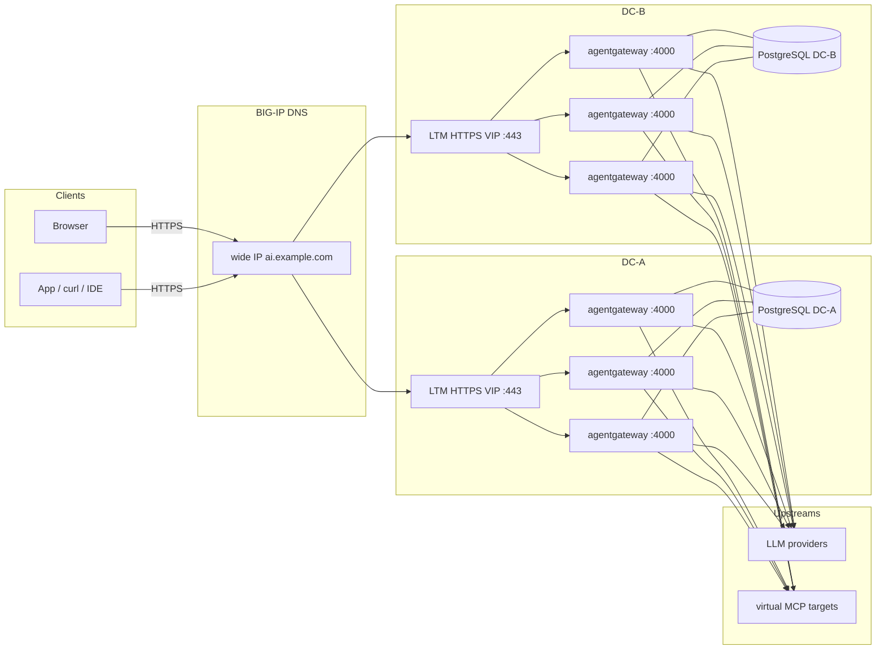

Most of what I've written about [agentgateway](https://agentgateway.dev)
assumes Kubernetes. This post is the F5 version of that sentence — the
front door you already own, not a cluster you have to invent.

What we're building is
[Solo Enterprise for agentgateway](https://docs.solo.io/agentgateway/standalone/latest/)
in **standalone mode**, sitting behind **classic BIG-IP LTM** in each
data center and **BIG-IP DNS** between them. The backend is a process
on **:4000**. Binary, Docker, or the standalone Helm chart as a
Deployment — F5 does not care, and neither does this post.

- One process per replica
- One config file as the baseline
- No enterprise control plane
- No custom resources

F5 is the load balancer and the DNS. It is not an AI proxy, and I am
not going to pretend an iRule can do Solo's job.

I'm pinning **2026.9.0** / **v2026.9.0**, the latest-stream release that
[adds standalone mode](https://docs.solo.io/agentgateway/standalone/latest/release-notes/release-notes/).
The current LTS streams are Kubernetes-mode only, so stay on latest
until the next LTS lands — Solo expects that around October.

One thing to be clear about up front: the F5 layout below is **how I
would integrate it**, not a joint Solo–F5 guide. No such guide exists.
The binary, image, license, storage, ports, LLM, and MCP all come from
Solo's public standalone docs, and if a command here ever disagrees
with that page, believe
[docs.solo.io](https://docs.solo.io/agentgateway/standalone/latest/).
Classic TMSH only. The module is still `gtm` even when the data sheet
says BIG-IP DNS. I am not going to invent F5 Next, NGINX One, or a
GUI click-path.

If you want a guest-by-guest RHEL and systemd walkthrough, the
[VMware / RHEL post](/articles/2026-09-10-solo-enterprise-agentgateway-standalone-on-vmware-rhel/)
is optional further reading. This one is not tied to VMware. The
backend is "a process on 4000."

Once it's up, clients hit one name:

| Address | Who uses it | Notes |
|---------|-------------|-------|
| `https://ai.example.com/ui` | You, in a browser | TLS on the LTM VIP; the backend is gateway **4000** |
| `https://ai.example.com/v1/chat/completions` | Apps, `curl`, IDEs | Unified LLM API on the same VIP |
| `https://ai.example.com/mcp` | MCP clients | Streamable HTTP, same VIP, same port |
| `:15000` | Operators on that host's loopback | Admin is loopback inside each process. F5 must not publish it |

## Why Enterprise standalone

Solo's own language, from the
[standalone introduction](https://docs.solo.io/agentgateway/standalone/latest/about/introduction/):
agentgateway is "built to be the most performant, reliable, and mature
LLM/MCP agentic gateway on the market." Built in Rust for long-lived
connections and fan-out. I'm not going to invent latency numbers on
top of that.

What you actually get — cited from that page and the
[virtual models](https://docs.solo.io/agentgateway/standalone/latest/llm/virtual-models/)
docs, not from a bench I ran in a lab:

- **Unified data plane.** HTTP, gRPC, LLM, MCP, and A2A on one proxy.
  Not a second "AI gateway" next to the one you already run.
- **Highly performant.** Rust. Optimized for high throughput, low
  latency, and stability on long-lived MCP sessions and fan-out.
- **Any agent framework.** LangGraph, AutoGen, kagent, Claude Desktop,
  the OpenAI SDK — anything that speaks MCP or A2A.
- **Platform-agnostic.** Bare metal, VM, container, Kubernetes. This
  post is the VM / process shape behind F5.
- **MCP multiplexing / tool federation / virtual MCP.** One client
  endpoint, several backend MCP servers.
- **Unified LLM API + virtual models.** Weighted, failover, or
  conditional routing behind one client-facing model name.
- **JWT / MCP authz, guardrails, budgets, hybrid UI overlay,
  observability.** The enterprise pieces that need a license and, for
  the overlay and Analytics, a database.

Standalone mode is the process plus a file. You get those features
without a control plane and without CRs. HA is replicas plus F5 plus
honest Postgres — not a second product.

## Before you start

Here's what you'll need:

- A **Solo Enterprise for agentgateway license key**. The proxy
  [refuses to start](https://docs.solo.io/agentgateway/standalone/latest/setup/license/)
  without a valid one. The placeholder everywhere below is
  `<license-key>`.
- **Two data centers** you already treat as failure domains.
- **LTM in each DC**, terminating TLS on an HTTPS VIP.
- A **BIG-IP DNS listener** (UDP/TCP 53) that recursive resolvers
  can reach. I am not going to invent a `named.conf`.
- **N standalone backends per DC** listening on **4000**. Three is a
  reasonable starting pool. Binary, Docker, or Helm-as-Deployment —
  same process, same port.
- **PostgreSQL per DC**, not one SQLite file on a share. Hybrid
  storage needs a `postgres://` URL.
- Somewhere to keep the license that **isn't git** —
  `ENTERPRISE_AGENTGATEWAY_LICENSE_KEY` or
  `config.license.key.file`. Prefer the file or the environment
  variable. An inline key is a key you will eventually commit.

Addresses below are placeholders. `10.10.10.0/24` is DC-A,
`10.20.20.0/24` is DC-B. The DNS listener uses an RFC 5737
documentation address. Swap them for yours.

## What standalone mode is

[Standalone mode](https://docs.solo.io/agentgateway/standalone/latest/about/introduction/)
is the agentgateway process plus a single configuration file. You can
install it as a
[binary](https://docs.solo.io/agentgateway/standalone/latest/setup/install/binary/),
a
[Docker container](https://docs.solo.io/agentgateway/standalone/latest/setup/install/docker/),
or a
[Helm Deployment](https://docs.solo.io/agentgateway/standalone/latest/setup/install/helm/)
— and none of those install a control plane.

| | Standalone (this post) | Kubernetes mode |
|--|------------------------|-----------------|
| What runs | The proxy process (scale it with more hosts) | Control plane + proxies |
| Source of truth | A config file plus an optional Postgres overlay | Enterprise CRs + Gateway API |
| License | **Each proxy** holds its own key | The control plane holds the key |
| HA behind F5 | N processes on :4000 + per-DC Postgres + LTM / DNS | A cluster, different charts |

You get the same enterprise features either way; what differs is the
operational model. Don't follow Kubernetes-mode pages for this
install — those charts and CRs aren't what this process reads. Stay
in the
[standalone docs](https://docs.solo.io/agentgateway/standalone/latest/).

### Why it belongs behind F5

A lot of production AI traffic still lives in a traditional DC:
VLANs, firewalls, a pair of BIG-IPs, and operators who already know
`tmsh`. Standalone is the mode Solo documents for that world —
ClickOps, a file, no Gateway API.

F5 already terminates TLS, health-checks pools, and — if you run
BIG-IP DNS — answers `ai.example.com` from the DC that is up. Put
the agentic proxy where the other proxies already sit: behind the
VIP, on a port the firewall already understands, with persistence
for the protocol that actually needs it.

The process does not need to know it is behind F5. Clients should
not need to know there is more than one of it.

## The shape of production



The picture is the same story as the mermaid.

<!-- GIFs: 01-traffic-flow.gif, 06-llm, 05-mcp — added in follow-up -->

Clients resolve `ai.example.com` at BIG-IP DNS. Each answer is a
**DC LTM VIP on :443**, not a backend. That VIP fans out to N
standalone proxies on **4000**. Those proxies talk to LLM providers
and to the MCP servers you federate. Postgres is **per DC**.

Two rules hold in a lab and in production:

1. **Clients use the gateway port, not 15000.** The generated
   standalone config attaches the UI to `default` on **4000**. Admin
   stays on loopback inside the process. Publishing 15000 isn't the
   supported UI path — the
   [binary](https://docs.solo.io/agentgateway/standalone/latest/setup/install/binary/)
   and
   [Docker](https://docs.solo.io/agentgateway/standalone/latest/setup/install/docker/)
   docs say so. F5 health-checks **4000**.
2. **The license is not optional.** A replica that can't present
   `ENTERPRISE_AGENTGATEWAY_LICENSE_KEY` or
   `config.license.key.file` will not start.

And one honesty about state: **F5 does not sync the hybrid UI
overlay.** `config.yaml` is the identical baseline you install in
both DCs. UI edits live in that DC's Postgres. Replicating Postgres
across DCs is out of scope here. If you need the same overlay in
both places, copy the file, or operate the overlay as DC-local.

## LLM gateway and virtual MCP on one VIP

Attach `llm` and `mcp` to the **same** `default` gateway. Put the UI
on that gateway too. Clients then hit:

- `https://<wide-ip>/v1/chat/completions`
- `https://<wide-ip>/mcp` (streamable HTTP)
- `https://<wide-ip>/ui`

In
[simplified LLM mode](https://docs.solo.io/agentgateway/standalone/latest/llm/virtual-models/),
`llm.models[]` are the concrete upstreams and
`llm.virtualModels[]` is the name the client asks for.
[Failover routing](https://docs.solo.io/agentgateway/standalone/latest/llm/virtual-models/)
needs `health.eviction` on those concrete models — `routing.failover`
alone does not spill to the next priority.

[Virtual MCP](https://docs.solo.io/agentgateway/standalone/latest/mcp/connect/virtual/)
is multiplexing: several targets in one backend, one federated
`tools/list`. That is a property of the backend, not of the
top-level `mcp` key — see
[configuration modes](https://docs.solo.io/agentgateway/standalone/latest/mcp/configuration-modes/).
Streamable HTTP targets use `mcp.host`
([HTTP connect](https://docs.solo.io/agentgateway/standalone/latest/mcp/connect/http/)).
**Target names cannot include underscores.**

Write the **same** file in both DCs. Host-specific bits should be
none except the Postgres URL, which is DC-local. In `hybrid` mode
the file is a read-only baseline, and the UI can't create a section
that doesn't exist — only resources inside one that already does.
Solo documents this as "sections must exist in the file."

```yaml
# config.yaml — identical baseline in both DCs except the Postgres host
# yaml-language-server: $schema=https://agentgateway.dev/schema/config
config:
  storage:
    mode: hybrid
  database:
    url: postgres://agw:<password>@<postgres-dc-a-host>:5432/agw
  license:
    key:
      file: /etc/agentgateway/license.key
gateways:
  default:
    port: 4000
ui:
  gateways: default
llm:
  providers: []
  models:
  - name: openai-primary
    visibility: internal
    provider: openAI
    params:
      model: gpt-4o
      apiKey: "$OPENAI_API_KEY"
    health:
      eviction:
        consecutiveFailures: 1
        duration: 60s
  - name: bedrock-backup
    visibility: internal
    provider: bedrock
    params:
      model: anthropic.claude-3-5-sonnet-20241022-v2:0
      awsRegion: us-west-2
    auth:
      aws: {}
    health:
      eviction:
        consecutiveFailures: 1
        duration: 60s
  virtualModels:
  - name: resilient
    routing:
      failover:
        targets:
        - model: openai-primary
          priority: 0
        - model: bedrock-backup
          priority: 1
mcp:
  targets:
  - name: docs
    mcp:
      host: https://<docs-mcp-host>/mcp
  - name: tickets
    mcp:
      host: https://<tickets-mcp-host>/mcp
  policies:
    cors:
      allowOrigins: ["*"]
      allowHeaders: ["*"]
      exposeHeaders: ["Mcp-Session-Id"]
```

`$OPENAI_API_KEY` is an environment variable, not a secret in git.
`auth.aws: {}` is Solo's ambient AWS credential path for Bedrock —
instance profile, `AWS_*` env, whatever that host already has. Don't
paste a real key into the file. DC-B gets the same YAML with
`<postgres-dc-b-host>`.

[SQLite](https://docs.solo.io/agentgateway/standalone/latest/setup/database/)
is for **one** instance. Do **not** point more than one
agentgateway at the same SQLite file. NFS does not make that legal.
`replica count > 1` means PostgreSQL. Hybrid refuses to start
without a URL:
`config.storage.mode=hybrid requires config.database.url`.

Schema appears on the **first agentgateway start**, not when you
`CREATE DATABASE`. Solo documents
`request_logs`, `request_log_payloads`, `budget_usage`, and
`agw_config_resources`.

MCP is stateful. Agentgateway encodes session state in
`Mcp-Session-Id` and pins a session to a backend target
([streamable HTTP](https://docs.solo.io/agentgateway/standalone/latest/mcp/connect/http/)).
That does not mean you should bounce the client between LTM pool
members mid-stream. Give LTM **source-address persistence** so a
session stays on one process. LLM `/v1/chat/completions` is closer
to request/response; it is still fine behind the same VIP.

## In-DC: F5 LTM

Do this on the BIG-IP in **each** DC. Comments are `#`. Addresses
are placeholders.

Health-check **4000**, not 15000. Primary monitor is HTTP `GET /ui`.
A TCP monitor on 4000 is fine if you prefer not to speak HTTP; I
would still start with `/ui`.

```
# LTM — DC-A sketch. Repeat in DC-B with 10.20.20.0/24.
# Health-check the gateway port. Do not probe 15000.

create ltm monitor http agw_http {
  defaults-from http
  destination *:4000
  interval 5
  timeout 16
  send "GET /ui HTTP/1.1\r\nHost: ai.example.com\r\nConnection: Close\r\n\r\n"
  recv "HTTP/1"
}

# Optional, if you would rather not HTTP-GET /ui:
# create ltm monitor tcp agw_tcp {
#   defaults-from tcp
#   destination *:4000
# }

create ltm pool agw_pool {
  load-balancing-mode least-connections-member
  monitor agw_http
  members add {
    10.10.10.11:4000 { address 10.10.10.11 }
    10.10.10.12:4000 { address 10.10.10.12 }
    10.10.10.13:4000 { address 10.10.10.13 }
  }
}

# MCP sessions should not hop members mid-stream.
create ltm persistence source-addr agw_src {
  timeout 1800
}

# TLS on the VIP. Backends stay plain HTTP on 4000.
# clientssl is the stock profile; replace with your named profile.
create ltm virtual agw_https {
  destination 10.10.10.10:443
  ip-protocol tcp
  mask 255.255.255.255
  pool agw_pool
  persist replace-all-with { agw_src { default yes } }
  profiles add { tcp { } http { } clientssl { } }
  source-address-translation { type automap }
}
```

DC-B is the same objects against `10.20.20.10:443` and
`10.20.20.11-13:4000`.

An iRule that tries to parse MCP JSON-RPC — or to "inspect AI
payloads" — is the wrong layer. Let agentgateway do AI policy:
authz, guardrails, budgets, virtual models. F5's job here is TLS,
pool membership, and persistence.

Firewall, boring on purpose:

- F5 self-IPs → each backend **4000/tcp**
- Each proxy → that DC's Postgres **5432/tcp**
- **Do not** open **15000** to the F5, to the VLAN, or to the VIP

If `/ui` is going on a network you don't trust, work through
[Secure the UI](https://docs.solo.io/agentgateway/standalone/latest/setup/ui/secure-ui/)
before you call it done.

## What failover in the DC actually is

I'm going to be deliberately boring here, because this is exactly
where integration posts start inventing features.

What you actually have:

- **N processes.** The LTM VIP removes a member that fails
  `agw_http`. systemd or the container runtime restarts a crashed
  process on that host. Neither of those is a clustered dataplane.
- **One overlay per DC.** In `hybrid` mode every replica in that DC
  reads the same Postgres, so a UI change isn't trapped on whichever
  host you happened to hit. The other DC has its own database.
- **Persistence, not magic.** Source-addr with a 1800s timeout keeps
  an MCP session on one member. A member that dies still drops
  in-flight work on that member. Clients retry.
- **Postgres must outlive a proxy.** If that DC's database dies,
  hybrid has nowhere to read the overlay from, and Analytics goes
  with it. The proxies are cattle. The database is not.

What Solo does **not** claim here — so I won't either — is a special
active-active dataplane, shared in-memory session state across
hosts, or any guarantee that the gateway never drops an in-flight
MCP session when a guest dies. The VIP removes a dead backend.
In-flight work on that host is gone. Do **not** share one SQLite
file across instances.

A rolling restart of one member is one process gone. Bounce every
member at once, or blip Postgres, and expect a **brief disruption**.
That's a pool, not a promise of zero-downtime sessions.

## Multi-DC: BIG-IP DNS

Lead with **active-active**. Both LTM VIPs stay in service. BIG-IP
DNS (tmsh module `gtm`) answers `ai.example.com` with the VIP that
the wide IP's pool mode selects — topology if you have topology
records, otherwise **ratio** or **round-robin**.
`global-availability` with both pools enabled can also serve both,
but I would rather say ratio or topology when I mean active-active.
Preferred-plus-alternate is the appendix.

GTM pool members are **`server-name:virtual-server-name`**, not a
bare `IP:port`. Create a datacenter, a `gtm server` that represents
the LTM (a real BIG-IP with iQuery, or a `generic-host` for just
the VIP), and a virtual server on that object whose destination is
the LTM VIP. If a field name shifted on your TMOS build, `list gtm
server` / `list gtm pool a` after a working create is the source of
truth — adjust member syntax to your TMOS version rather than
inventing a flag. The forms below are the ones used on TMOS 15+/17+.

```
# BIG-IP DNS / gtm — active-active sketch
# Probe the LTM VIP, not the agentgateway backends.

create gtm datacenter /Common/dc-a { }
create gtm datacenter /Common/dc-b { }

create gtm monitor https agw_vip_https {
  defaults-from https
  send "GET /ui HTTP/1.1\r\nHost: ai.example.com\r\nConnection: Close\r\n\r\n"
  recv "HTTP/1"
  sni-server-name ai.example.com
}

# generic-host: the object is the LTM VIP. product bigip is fine
# instead if this is a real BIG-IP and you want iQuery.
create gtm server ltm-dc-a {
  datacenter dc-a
  product generic-host
  devices add { ltm-dc-a { addresses add { 10.10.10.10 { } } } }
  virtual-servers add { agw-https { destination 10.10.10.10:443 } }
  monitor agw_vip_https
}

create gtm server ltm-dc-b {
  datacenter dc-b
  product generic-host
  devices add { ltm-dc-b { addresses add { 10.20.20.10 { } } } }
  virtual-servers add { agw-https { destination 10.20.20.10:443 } }
  monitor agw_vip_https
}

create gtm pool a agw_a_dc_a {
  load-balancing-mode round-robin
  ttl 30
  monitor agw_vip_https
  members add { ltm-dc-a:agw-https { member-order 0 } }
}

create gtm pool a agw_a_dc_b {
  load-balancing-mode round-robin
  ttl 30
  monitor agw_vip_https
  members add { ltm-dc-b:agw-https { member-order 0 } }
}

# Active-active: both pools in service.
# topology only works if you have gtm topology records.
# ratio / round-robin is the simpler active-active.
create gtm wideip a ai.example.com {
  pools add {
    agw_a_dc_a { order 0 ratio 1 }
    agw_a_dc_b { order 1 ratio 1 }
  }
  pool-lb-mode topology
}
```

If you have not built topology records yet, set
`pool-lb-mode ratio` or `pool-lb-mode round-robin` on that wide IP.
Don't enable `topology` and then wonder why every answer looks
round-robin — the method is a no-op without a topology map, and I
am not going to invent yours.

Listener, high level only. A GTM listener is an IP that accepts DNS
on port 53. You already have a DNS profile on the box; attach it.
Don't copy a `named.conf` out of a blog post.

```
# Reminder, not a full DNS build-out.
# create gtm listener dns_udp address 192.0.2.53 port 53 ip-protocol udp
# create gtm listener dns_tcp address 192.0.2.53 port 53 ip-protocol tcp
# profiles default to dns + udp_gtm_dns / tcp if you omit them.
```

Point the zone's delegation or the recursive forwarders you already
run at that listener. The wide IP is the record BIG-IP DNS will
synthesize.

Honest about health: GTM has to probe something that means "this
DC's front door is up." That is the **LTM VIP**, with a request
that matches what LTM is serving — `GET /ui` over HTTPS, Host
`ai.example.com`. If the whole DC VIP is down, DNS stops handing
out that A record. If you probe backend IPs instead, you can mark
a DC up while the VIP is down, or down while the VIP is fine. Probe
the VIP.

`bigip` as a GTM monitor is the other well-known choice when the
server object is a real BIG-IP and iQuery is up. It still has to
represent VIP health, not a random self-IP.

## Appendix: active-standby wide IP

Same objects as above. The wide IP prefers one pool and fails over
when that pool is down. `global-availability` walks pools in order.

```
# Appendix — active-standby. Preferred DC-A, alternate DC-B.
create gtm wideip a ai.example.com {
  pools add {
    agw_a_dc_a { order 0 }
    agw_a_dc_b { order 1 }
  }
  pool-lb-mode global-availability
}
```

Disable the preferred pool (or the datacenter, or the LTM virtual)
and the next healthy pool is the answer. Re-enable it and
`global-availability` walks back to order 0. That is failover, not
active-active. Don't call it both.

TTL on the pool still matters. A 30-second TTL is a starting
point, not a promise that every stub resolver will forget DC-A in
30 seconds.

## Smoke tests

Placeholders only. `<dns-listener>` is the BIG-IP DNS listener.
`ai.example.com` is the wide IP.

```sh
# 1. Wide IP from more than one place — both DCs should be
#    eligible in the active-active layout.
dig @<dns-listener> ai.example.com A +short
# expect 10.10.10.10 and/or 10.20.20.10

# 2. UI on the gateway path, through the VIP — not :15000
curl -sI https://ai.example.com/ui | head -5

# 3. Unified LLM API — virtual model name, not the internal ones
curl -sS https://ai.example.com/v1/chat/completions \
  -H 'Content-Type: application/json' \
  -d '{
    "model": "resilient",
    "messages": [{"role": "user", "content": "Say hello in one sentence."}]
  }'

# 4. Virtual MCP initialize (streamable HTTP)
curl -sS https://ai.example.com/mcp \
  -H 'Content-Type: application/json' \
  -H 'Accept: application/json, text/event-stream' \
  -d '{
    "jsonrpc": "2.0",
    "id": 1,
    "method": "initialize",
    "params": {
      "protocolVersion": "2024-11-05",
      "capabilities": {},
      "clientInfo": {"name": "smoke", "version": "0.0.1"}
    }
  }'

# 5. Admin is not the front door
curl -sS --connect-timeout 2 https://ai.example.com:15000/ui || true
```

On a proxy host — SSH in, don't publish 15000:

```sh
curl -s localhost:15000/api/runtime | jq '{license, ui}'
# license.state: running
# ui.configStoreMode: hybrid
```

In-DC failover:

```
# on the DC-A BIG-IP — one member out, VIP still answers
modify ltm pool agw_pool members modify {
  10.10.10.11:4000 { session user-disabled }
}
```

```sh
curl -sI https://ai.example.com/ui | head -5
```

```
modify ltm pool agw_pool members modify {
  10.10.10.11:4000 { session user-enabled }
}
```

Multi-DC failover:

```
# take DC-A's VIP out of DNS
modify gtm pool a agw_a_dc_a disabled
```

```sh
dig @<dns-listener> ai.example.com A +short
# should stop handing out 10.10.10.10 once the monitor / pool is down
```

```
modify gtm pool a agw_a_dc_a enabled
```

If the proxies are up and `curl` to the VIP fails, the problem is
the pool, the clientssl profile, or the VLAN — not agentgateway. If
a process exits immediately, read its log for the license check or
a Postgres URL it cannot open before you debug GTM.

## Mistakes that will cost you an afternoon

1. **Health-checking 15000.** Admin is loopback. The monitor has to
   hit **4000**. A pool of "down" members with healthy processes is
   this mistake.
2. **No persistence for MCP.** Chat completions will mostly forgive
   you. A streamable HTTP session that hops members mid-stream will
   not. Source-addr, timeout around 1800s.
3. **Sharing SQLite across instances.** Solo tells you not to. NFS
   does not help. `replica count > 1` means PostgreSQL.
4. **TLS only on the backend, not the VIP.** Clients should see
   HTTPS on :443. The pool members can stay HTTP on 4000. Don't
   publish 15000 "for HTTPS."
5. **GTM probing backend IPs instead of the LTM VIP.** DNS should
   follow VIP health. A healthy guest behind a down virtual is not
   a DC you should advertise.
6. **Committing the license** — or an inline key in `config.yaml`
   that ends up in git. Use
   `ENTERPRISE_AGENTGATEWAY_LICENSE_KEY` or
   `config.license.key.file`. Placeholder `<license-key>` only.
7. **Assuming F5 syncs the hybrid overlay across DCs.** It doesn't.
   Identical `config.yaml` baseline; overlay is DC-local unless you
   replicate Postgres, which this post does not.
8. **Following Kubernetes-mode docs, or calling this a joint
   Solo–F5 architecture.** Different control plane, different CRs, a
   different license holder. This post is
   [standalone](https://docs.solo.io/agentgateway/standalone/latest/)
   behind classic LTM and `gtm`.

## What's reachable

| Address | Production |
|---------|------------|
| Gateway UI | `https://ai.example.com/ui` (DNS → LTM :443 → :4000) |
| LLM | `https://ai.example.com/v1/chat/completions` |
| Virtual MCP | `https://ai.example.com/mcp` |
| `:15000` on the VIP | No |
| `localhost:15000` on a proxy | Debug and `api/runtime` only |

## What this is, and isn't

You get the enterprise proxy as N standalone processes per DC: one
`config.yaml` baseline, a Postgres overlay in that DC, and F5 as
the front door you already know how to run. LLM and virtual MCP
share gateway port 4000. The license is checked at startup. The
same features as Kubernetes mode, without that control plane.

What you don't get is a Solo-documented zero-downtime mesh, a
synced UI overlay between DCs, an F5 iApp, or a joint reference
architecture. LTM drops bad members. BIG-IP DNS stops handing out a
dead VIP. Bouncing a host drops in-flight work on that host. That's
the whole failover story — and it's enough, provided Postgres, the
replica count, and the health checks are honest.

Rotate anything that ended up in a ticket. Don't commit a license
file or a `config.yaml` carrying a real `postgres://` password, and
don't leave an unauthenticated `/ui` on a network you don't trust.

## The takeaway

The integration is thin on purpose. Solo has already documented
standalone mode, the public binary, `hybrid` storage, virtual
models, virtual MCP, and "do not share SQLite." F5 is simply the
front door those replicas sit behind: LTM in the DC, BIG-IP DNS
between DCs, health checks on 4000, persistence for MCP, Postgres
that survives any one proxy.

Pin `v2026.9.0`, run a process on 4000, give every replica in a DC
the same PostgreSQL URL, publish the gateway port, keep 15000 off
the F5, and keep the license out of git. Active-active on the wide
IP unless you have a reason to prefer a DC. That's the production
path.

---

*Standalone docs home:
[docs.solo.io/agentgateway/standalone/latest](https://docs.solo.io/agentgateway/standalone/latest/).
Introduction and feature list:
[about/introduction](https://docs.solo.io/agentgateway/standalone/latest/about/introduction/).
Binary install, generated config on 4000, and `-f`:
[setup/install/binary](https://docs.solo.io/agentgateway/standalone/latest/setup/install/binary/).
Docker (UI on 4000, admin on loopback):
[setup/install/docker](https://docs.solo.io/agentgateway/standalone/latest/setup/install/docker/).
`file` vs `hybrid` / the overlay, and "sections must exist in the file":
[setup/storage](https://docs.solo.io/agentgateway/standalone/latest/setup/storage/).
SQLite vs PostgreSQL and "do not share one SQLite file":
[setup/database](https://docs.solo.io/agentgateway/standalone/latest/setup/database/).
The license env var and `config.license.key.file`:
[setup/license](https://docs.solo.io/agentgateway/standalone/latest/setup/license/).
Virtual models (weighted, failover, conditional):
[llm/virtual-models](https://docs.solo.io/agentgateway/standalone/latest/llm/virtual-models/).
OpenAI and Bedrock providers:
[llm/providers/openai](https://docs.solo.io/agentgateway/standalone/latest/llm/providers/openai/),
[llm/providers/bedrock](https://docs.solo.io/agentgateway/standalone/latest/llm/providers/bedrock/).
Virtual MCP / multiplexing (target names cannot include `_`):
[mcp/connect/virtual](https://docs.solo.io/agentgateway/standalone/latest/mcp/connect/virtual/).
Configuration modes:
[mcp/configuration-modes](https://docs.solo.io/agentgateway/standalone/latest/mcp/configuration-modes/).
Streamable HTTP:
[mcp/connect/http](https://docs.solo.io/agentgateway/standalone/latest/mcp/connect/http/).
Release stream:
[release notes](https://docs.solo.io/agentgateway/standalone/latest/release-notes/release-notes/).
The LTM / BIG-IP DNS layout in this post is operational advice, not
a joint reference architecture.*
